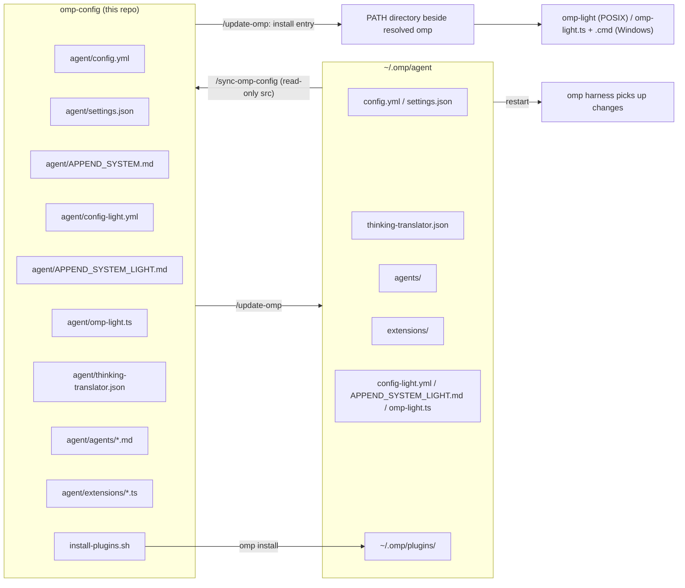

# Repository Guidelines

## Project Overview

`omp-config` is the auditable, version-controlled slice of the user's Oh My Pi
(`omp`) coding-harness configuration — **not** a full `~/.omp` backup
(`README.md:1-3`). It holds only reviewable inputs: harness config, full and
light system prompts, light-mode config and launcher source, custom subagent
definitions, local TypeScript extensions, the agent-root
`thinking-translator.json` for `omp-thinking-translator`, the plugin install
list, and the maintenance commands that move state between this repo and a
machine's live `~/.omp/agent` and install its PATH launcher. Runtime
state (databases, sessions, caches, credentials) is deliberately excluded.

The repo is consumed by `omp` in two directions:
- **repo → machine**: `/update-omp` applies this snapshot to `~/.omp/agent`.
- **machine → repo**: `/sync-omp-config` captures eligible local state back here.

## Architecture & Data Flow



- **Config vs behavior are separated.** Agent *responsibilities* live in
  `agent/APPEND_SYSTEM.md` + `agent/agents/*.md`; agent *model bindings* live only
  in `agent/config.yml` under `task.agentModelOverrides`. Changing a model never
  changes an agent's capability boundary (`README.md`).
- **Extensions are loaded per session** from the paths in `settings.json` /
  `config.yml`; each is a default-exported function that registers tools/commands
  or subscribes to lifecycle events on the `ExtensionAPI` (`pi`).
- **Two one-way syncs, never one "sync".** `/sync-omp-config` never writes the
  machine; its sync range includes the three light assets and the agent-root
  `thinking-translator.json` but excludes installed PATH launchers.
  `/update-omp` writes the machine and installs `omp-light` beside the resolved
  `omp` executable (`.omp/commands/*.md`).
- **Structured configs are managed in both directions, field by field.**
  `config.yml`, `settings.json`, the agent-root `thinking-translator.json`, and
  `extensions/lang-nag.json` are regular items of both commands: each side reads
  both files, diffs fields, and edits only the differing lines — never a
  whole-file overwrite or re-serialization. `config.yml`'s machine-local fields
  (listed in `.omp/commands/sync-omp-config.md`) are never carried either way.
  `/update-omp` updates agent definitions and their `config.yml` model bindings
  together. Both sides validate with `bun -e` + `Bun.YAML.parse` / `JSON.parse`.
  This is **not** like `doc-polish.json` (machine-local, prompt-overridable) or
  `commandcode-models.json` (machine-generated, never migrated).
- **Plugins are runtime state**, installed via `omp install` into
  `~/.omp/plugins/` and never copied into this repo (`README.md`).

## Key Directories

| Path | Purpose |
| --- | --- |
| `agent/` | Managed harness config. Only listed items are portable; the whole dir is **not**. |
| `agent/extensions/` | Local TypeScript extensions (the code core). 17 `.ts` (incl. `bro.ts`, the built-in-AI rewrite of the former `pi-bro` plugin, `watchdog-agent.ts`, `fork-task.ts`, which seeds native `task` children with a copy of the caller's conversation, and `task-split-check.ts`, which blocks main-agent `task` calls whose items bundle independent tasks) + `doc-polish.json`/`lang-nag.json` sidecars (`lang-nag.json` is synced both ways; `doc-polish.json` is machine-local/prompt-overridable — see Important Files). |
| `agent/agents/` | Custom subagent definitions (`*.md`) + `README.txt` authoring pitfalls. |
| `agent/thinking-translator.json` | Agent-root translator config for `omp-thinking-translator`. Portable regular item: `/sync-omp-config` carries machine → repo, `/update-omp` carries repo → machine. |
| `.omp/commands/` | Project-level slash-command definitions run from repo root. |
| repo root | `install-plugins.sh`, `plugin-audit.sh`, `README.md` (authoritative, in Chinese). |
| `agent/config-light.yml`, `agent/APPEND_SYSTEM_LIGHT.md`, `agent/omp-light.ts` | Light-mode assets are included in both sync directions; `/update-omp` copies them to `~/.omp/agent` and installs the PATH entry beside the resolved `omp`. Generated `omp-light` / `omp-light.cmd` entries are not repo files. |

## Development Commands

Slash commands run inside `omp` started at the repo root:

```
/update-omp [check]           # repo -> machine (writes); field-level edits for config.yml/settings.json/JSON; installs omp-light beside PATH's resolved omp
/sync-omp-config [check]      # machine -> repo (repo write only); syncs light assets, never installed PATH entries. Full mode commits+pushes
/migrate-omp-keys <target>    # SSH-copy auth_credentials to a remote omp host (not a snapshot path)
```

Shell scripts run from repo root:

```bash
./plugin-audit.sh             # read-only: diff install-plugins.sh (history from base 5974c4fa) vs `omp plugin list`
./install-plugins.sh          # `omp install` each declared plugin into ~/.omp/plugins (network required)
```

Post-change / verification:

```bash
omp config list --json        # confirm applied config values
omp plugin list --json        # confirm plugin names/versions/enabled
git status --short            # confirm no runtime/db/cache files leaked into the repo
```

There is **no** `build`/`lint`/`test` command — this repo has none (see Testing & QA).

## Code Conventions & Common Patterns

### Extensions (`agent/extensions/*.ts`)

- **File naming:** lowercase kebab-case (`ctx-tool.ts`, `tool-policy-nag.ts`);
  default export is a camelCase function matching the filename (`ctxTool`,
  `toolPolicyNag`).
- **Authoring shape:** default-exported `(pi: ExtensionAPI) => void` that
  registers and/or subscribes; example (`agent/extensions/ctx-tool.ts:1517-1546`):
  ```ts
  export default function ctxTool(pi: ExtensionAPI): void {
    pi.registerTool({
      name: "ctx",
      label: "...",
      approval: "read",
      loadMode: "essential",
      parameters: contextParams,
      async execute(_toolCallId, params, signal, _onUpdate, ctx) {
        return { content: [{ type: "text", text }] };
      },
    });
  }
  ```
- **Two idioms:** tool/command registration (`pi.registerTool`,
  `pi.registerCommand`, `pi.setLabel`) vs pure hooks (`pi.on(event, handler)`).
  Hook-only extensions register nothing (e.g. `repo-rules.ts`,
  `tool-policy-nag.ts`, `commandcode-model-spec.ts`).
- **Lifecycle events used:** `session_start`, `before_agent_start`, `input`,
  `tool_call`, `tool_result`, `message_end`, `session_compact`,
  `auto_compaction_end`, `before_subagent_spawn`, `session_shutdown`,
  `session_switch/branch/tree`.
- **Imports:** type-only `ExtensionAPI`/`ExtensionContext`; runtime imports from
  `@oh-my-pi/pi-coding-agent` (`createAgentSession`, `SessionManager`, `z`,
  `getAgentDir`, ...), `@oh-my-pi/pi-natives` (`glob`/`grep`), `@oh-my-pi/pi-ai`
  (usage types). Node built-ins (`node:fs`, `node:path`, `node:crypto`, ...) are
  used heavily.
- **Helper sessions pass `taskDepth: 1`:** every `createAgentSession` an
  extension builds for its own model calls (`bro.ts`, `doc-polish.ts`,
  `lang-nag.ts`, `watchdog-agent.ts`, `fork-task.ts`) sets `taskDepth: 1`.
  Without it the SDK classifies the helper as a main session, and its
  `dispose()` tears down the global `AgentLifecycleManager`, releasing every
  idle subagent (they become `Unknown agent` and can no longer be messaged).
- **Error handling:** hooks/tools are defensive — scan/read/glob failures degrade
  to empty/none or warnings rather than throwing (`ctx-tool.ts:442-457`,
  `ctx-tasklog.ts:239-267`). Model/provider request failures in `doc-polish.ts`
  retry 3× then surface a structured `DocPolishRuntimeError` without leaking
  secrets (`doc-polish.ts:279-300`).
- **State:** kept in the extension closure or module-level caches; durable state
  goes through session custom entries (e.g. `tool-policy-nag.ts` persists
  `mouriya.omp.tool-policy-nag.state` and rebuilds it on restore).
- **Schemas:** validate untrusted input at boundaries — imported `z` for internal
  schemas, `pi.zod` for registered tool parameter schemas.
- **Process-wide patches are idempotent + un-removable:**
  `xai-oauth-cost-ticks.ts` wraps `globalThis.fetch` and `v2-compaction-timeout.ts`
  rewrites `AbortSignal.timeout(180000)→600000`, both guarded by `Symbol.for`
  marks. Do not add a second wrapper or broaden the match.
- **Style is not uniform** (tabs/double-quotes vs spaces/single-quotes across
  files) and there is no formatter. Preserve each file's local style; never
  restyle as part of a change.

### Subagent definitions (`agent/agents/*.md`)

- YAML frontmatter: `name`, `description`, `spawns` (comma list). **No `model`
  field** — model binding lives in `config.yml`.
- Prefer an explicit `spawns` allowlist over `"*"`; the **first** listed name is
  the silent default for an omitted `agent`, so files list `task:low` first
  (`agent/agents/README.txt:24-35`).
- Read `agent/agents/README.txt` before editing — it documents hard traps:
  `task.disabledAgents` (`task`, `scout`, `sonic`, `reviewer`,
  `security-reviewer`) fail even if allowlisted; recursion depth caps at 2
  (grandchildren cannot spawn); a `yield`-only agent can lose its answer; edits
  apply on next spawn (no hot reload); a broken definition is skipped with a log
  warning, not a call-site error.
- **Keep non-agent notes as `.txt`** — every `.md` here is parsed as an agent
  candidate and a plain note becomes permanent per-dispatch log noise
  (`agent/agents/README.txt:130-139`).

## Important Files

- `agent/config.yml` — harness + UI config. Key sections: `extensions: [~/.claude]`,
  `task.agentModelOverrides` (model/fallback chains per tier),
  `task.disabledAgents`, `compaction.methodOrder` + `thresholdTokens: 500000`,
  feature toggles (`astGrep.enabled: true`, `github.enabled: true`,
  `fetch.enabled: false`, `browser.enabled: false`).
- `agent/settings.json` — minimal legacy extension path: `{"extensions": ["~/.claude"]}`.
- `agent/APPEND_SYSTEM.md` — global system-prompt appendix (orchestration stance,
  agent tiers, shared-checkout vs `isolated: true` rules, tool policy). Task children
  never receive it, so rules they need are repeated in the `task:*` definitions.
- `agent/config-light.yml` — declarative light-mode config overlay: disables ten
  optional behavior extensions while retaining the three core extensions and four
  compatibility/runtime fixes described in `README.md`.
- `agent/APPEND_SYSTEM_LIGHT.md` — short system-prompt appendix used only by
  `omp-light`; the normal `APPEND_SYSTEM.md` remains the full-mode prompt.
- `agent/omp-light.ts` — portable `#!/usr/bin/env bun` launcher source. `/update-omp`
  installs it as executable `omp-light` on POSIX/macOS/Linux, or as
  `omp-light.ts` plus a generated `omp-light.cmd` on Windows, beside the resolved
  `omp`; generated entries are not part of the repo copy set.
- `agent/thinking-translator.json` — agent-root config read by
  `omp-thinking-translator` at `~/.omp/agent`. Managed regular item in both
  directions (field-level diff and edit; validate with `bun -e` + `JSON.parse`). Unlike
  `agent/extensions/doc-polish.json` below, it is portable, not machine-local.
- `agent/extensions/doc-polish.json` — active config for `doc-polish.ts`
  (`splitModel`, `polishModel`, `concurrency`; `checkModel` optional, omitted
  here). Machine-local and prompt-overridable: `/update-omp` never touches an
  existing live copy and asks before creating a missing one. A cwd-local
  `doc-polish.json` wins over this one. **Distinct** from `ctx`
  `.md`/`.json` sidecar artifacts.
- `install-plugins.sh` — declared plugin list: `pi-commandcode-provider`,
  `pi-package-search`, `pi-unified-exec`, `pi-pretty-codeblocks`, `pi-schedule`, and
  the GitHub URL `Mouriya-Emma/omp-thinking-translator` (unpinned; `omp install`
  resolves versions; its runtime config is the portable agent-root `thinking-translator.json` above). The former `pi-bro` plugin is now the local `agent/extensions/bro.ts`.
- `plugin-audit.sh` — drift report; base commit `5974c4fa`; requires `omp` on PATH
  and a git worktree.
- `.omp/commands/{update-omp,sync-omp-config,migrate-omp-keys}.md` — the command
  contracts; read these for exact copy/exclusion/validation rules.

Direct-migration copy set (never copy the whole `agent/`; `README.md`):

```bash
mkdir -p "$HOME/.omp/agent"
cp agent/config.yml agent/settings.json agent/APPEND_SYSTEM.md \
  agent/thinking-translator.json \
  agent/config-light.yml agent/APPEND_SYSTEM_LIGHT.md agent/omp-light.ts \
  "$HOME/.omp/agent/"
cp -a agent/agents agent/extensions "$HOME/.omp/agent/"
```

The installed `omp-light` / `omp-light.cmd` entries are generated outputs, not
copy-set files. Direct migration must also run `/update-omp` on the target, or
perform the same installation beside the resolved `omp` on `PATH`; copying the
three light assets alone does not make `omp-light` resolvable.

## Runtime/Tooling Preferences

- **Harness/runtime is Bun-based** (`omp`). Extensions run under it; validation
  one-liners use `bun -e` (e.g. `Bun.YAML.parse`, `JSON.parse`). Most extensions
  use Node built-ins + Web APIs; only `unified-exec-bun-pty.ts` is Bun-specific,
  and it is gated to `darwin` + `arm64` for `pi-unified-exec` PTY support.
- **Plugins:** installed with `omp install` (network) into `~/.omp/plugins/`
  (`package.json`, `bun.lock`, `node_modules/`, `omp-plugins.lock.json`). These are
  machine state, not repo content.
- **Agent dir:** `~/.omp/agent`. The PTY native cache sits one level above it.
- The installed `omp-light` entry is not stored in `~/.omp/agent`: it is
  placed beside the resolved `omp` executable so the existing `PATH` finds it.
- **Restart required:** `APPEND_SYSTEM.md`, extensions, and plugins take effect on
  the next `omp` start (`.omp/commands/update-omp.md:57`); agent `*.md` edits
  apply on next spawn without restart.
- **Never commit** (per `.gitignore`): `agent/*.db*`, `*.lock`, `config.yml.lock`,
  `models.yml*`, `commandcode-models.json`, `sessions/`, `terminal-sessions/`,
  `blobs/`, `cache/`, `plugins/node_modules/`, logs, and anything credential-bearing.
- **Do not overwrite app-managed files:** files marked
  `// @orca-managed-pi-extension` or `marker: _otty` (e.g. `orca-*.ts`,
  `otty-integration.ts`) are maintained by their apps — presence of the marker,
  not the filename, controls exclusion.

## Testing & QA

- **No formal test suite, no CI, no hooks, no type-check/lint/format config**
  (no `*.test.*`/`*.spec.*`, `.github/workflows`, `tsconfig.json`, `package.json`,
  eslint/prettier/biome). Nothing repo-local type-checks the `.ts` extensions.
- **`plugin-audit.sh` validates the plugin *list*, not extension code** — it
  cannot prove anything about a `.ts` edit.
- **How to validate a change here:**
  1. `bun -e` parse check for any changed YAML/JSON (`config.yml`, `*.json`) — including `agent/thinking-translator.json` via `JSON.parse` on both sync and update paths.
  2. For an extension change, the only real proof is runtime: apply via
     `/update-omp` (or the `cp` set), **restart `omp`**, and exercise the actual
     tool/command/hook (e.g. run `ctx list`, `/polish-doc <file>`, trigger the
     targeted hook) — then verify observed output/side effects. A `bun -e` parse
     or `cmp` is necessary but **not** sufficient.
  3. `omp config list --json`, `omp plugin list --json`, `git status --short` to
     confirm applied state and that no runtime/credential files leaked.
- If runtime verification isn't possible, say so explicitly — parse-clean +
  `cmp`-identical does not mean correct.
- **Credential safety:** `/migrate-omp-keys` copies only the `auth_credentials`
  table, backs up the remote DB with SQLite `.backup`, requires confirmation, and
  never prints credential data. Never route secrets through the repo snapshot.
