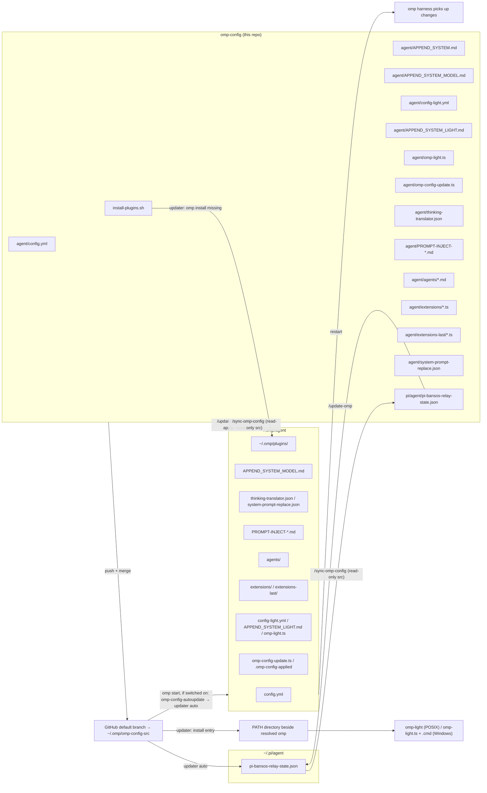

# Repository Guidelines

## Project Overview

`omp-config` is the auditable, version-controlled slice of the user's Oh My Pi
(`omp`) coding-harness configuration — **not** a full `~/.omp` backup
(`README.md:1-3`). It holds only reviewable inputs: harness config, full and
light system prompts, light-mode config and launcher source, custom subagent
definitions, local TypeScript extensions, the agent-root
`thinking-translator.json` for `omp-thinking-translator`, the agent-root
`PROMPT-INJECT-*.md` templates for `user-prompt-inject.ts`, the agent-root
`APPEND_SYSTEM_MODEL.md` for `append-system-model.ts` (when the machine has one), the agent-root
`system-prompt-replace.json` for `extensions-last/system-prompt-replace.ts`, the `pi-bansos`
plugin state (`pi/agent/pi-bansos-relay-state.json`), the plugin install
list, the repo → machine updater (`agent/omp-config-update.ts`) with its
startup hook, and the maintenance commands that move state between this repo
and a machine's live `~/.omp/agent` (plus `~/.pi/agent` for the `pi-bansos`
state) and install its PATH launcher. Runtime
state (databases, sessions, caches, credentials) is deliberately excluded.

The repo is consumed by `omp` in two directions:
- **repo → machine**: `/update-omp` runs `omp-config-update.ts apply` against the
  working checkout. Opt-in per machine (`/omp-config-autoupdate on`, off by
  default), `extensions/omp-config-autoupdate.ts` runs `omp-config-update.ts auto`
  at every `omp` start, which fetches the GitHub default branch into its own
  clone (`~/.omp/omp-config-src`) and applies it when the commit differs from
  the one recorded in `<agent dir>/.omp-config-applied`.
- **machine → repo**: `/sync-omp-config` captures eligible local state back here.

## Architecture & Data Flow


```mermaid
flowchart LR
  subgraph repo["omp-config (this repo)"]
    A["agent/config.yml"]
    P["agent/APPEND_SYSTEM.md"]
    PM["agent/APPEND_SYSTEM_MODEL.md"]
    L1["agent/config-light.yml"]
    L2["agent/APPEND_SYSTEM_LIGHT.md"]
    L3["agent/omp-light.ts"]
    U["agent/omp-config-update.ts"]
    T["agent/thinking-translator.json"]
    Q["agent/PROMPT-INJECT-*.md"]
    G["agent/agents/*.md"]
    E["agent/extensions/*.ts"]
    EL["agent/extensions-last/*.ts"]
    R["agent/system-prompt-replace.json"]
    I["install-plugins.sh"]
    B["pi/agent/pi-bansos-relay-state.json"]
  end
  GH["GitHub default branch → ~/.omp/omp-config-src"]
  subgraph machine["~/.omp/agent"]
    LA["config.yml"]
    LM["APPEND_SYSTEM_MODEL.md"]
    LT["thinking-translator.json / system-prompt-replace.json"]
    LQ["PROMPT-INJECT-*.md"]
    LG["agents/"]
    LE["extensions/ / extensions-last/"]
    LL["config-light.yml / APPEND_SYSTEM_LIGHT.md / omp-light.ts"]
    LU["omp-config-update.ts / .omp-config-applied"]
    PL["~/.omp/plugins/"]
  end
  subgraph pihome["~/.pi/agent"]
    LB["pi-bansos-relay-state.json"]
  end
  O["PATH directory beside resolved omp"]
  M["omp-light (POSIX) / omp-light.ts + .cmd (Windows)"]
  repo -->|"push + merge"| GH
  GH -->|"omp start, if switched on: omp-config-autoupdate → updater auto"| machine
  GH -->|"updater auto"| LB
  repo -->|"/update-omp: updater apply --source ."| machine
  B -->|"/update-omp"| LB
  LB -->|"/sync-omp-config (read-only src)"| B
  GH -->|"updater: install entry"| O
  O --> M
  machine -->|"/sync-omp-config (read-only src)"| repo
  I -->|"updater: omp install missing"| PL
  machine -->|restart| H["omp harness picks up changes"]
```

- **Config vs behavior are separated.** Agent *responsibilities* live in
  `agent/APPEND_SYSTEM.md` + `agent/agents/*.md`; agent *model bindings* live only
  in `agent/config.yml` under `task.agentModelOverrides`. Changing a model never
  changes an agent's capability boundary (`README.md`).
- **Extensions are loaded per session** from native discovery and the
  `config.yml` `extensions` paths; each is a default-exported function that registers tools/commands
  or subscribes to lifecycle events on the `ExtensionAPI` (`pi`).
- **Load order is hook order.** `before_agent_start` handlers run extension by
  extension in load order, each receiving the system prompt the previous one
  returned (not every event is serial: `session_shutdown` handlers run
  concurrently). Order: native discovery (`~/.omp/agent/extensions/`; a legacy
  `settings.json` `extensions` list only when no `config.yml` exists) → hooks → plugin extensions → `-e` paths →
  `config.yml` `extensions` in list order → OMP's inline factories
  (SDK-supplied extensions, autoresearch, the custom-tools wrapper); a path loads
  once, at its first occurrence. `extensions-last/system-prompt-replace.ts` must
  therefore stay the last `config.yml` `extensions` entry and outside
  `extensions/`, which makes it last among path-loaded extensions; inline
  factories still run after it (autoresearch rewrites the prompt only in
  autoresearch mode). Within `extensions/` the order is whatever the native
  `glob` walk returns — no sort, not filename order — so filename prefixes
  cannot order extensions.
- **Two one-way syncs, never one "sync".** `/sync-omp-config` never writes the
  machine; its sync range includes the three light assets, `omp-config-update.ts`, the agent-root
  `thinking-translator.json`, `system-prompt-replace.json`, `APPEND_SYSTEM_MODEL.md`, `extensions-last/*.ts`, and `PROMPT-INJECT-*.md` templates, and
  `~/.pi/agent/pi-bansos-relay-state.json`, but excludes installed PATH launchers
  and `.omp-config-applied`. Repo → machine is the updater
  (`agent/omp-config-update.ts`; its header is the contract): automatically at
  start, or via `/update-omp`. It writes the machine and installs `omp-light`
  beside the resolved `omp` executable. Its managed set (`managedPlain`,
  `STRUCTURED`) must match the sync range in `.omp/commands/sync-omp-config.md`.
- **The repo wins on managed items; everything else is the host's.** The updater
  overwrites managed files and managed keys, host edits included (in `auto`
  mode only when the fetched commit differs from the applied one; `/update-omp`
  applies the working tree whenever run). It never touches host-only files,
  host-only keys (unless the repo turns their parent map into a non-map),
  `config.yml`'s machine-local fields (`LOCAL_CONFIG_FIELDS` in the updater,
  also used by `/sync-omp-config`; their ancestors are never replaced by a
  non-map), machine entries of `config.yml` `extensions` (`MACHINE_LIST_FIELDS`:
  entries the repo's list does not have, kept ahead of the repo's entries and
  never synced back, e.g. `~/.claude`), app-managed files, unparsable host
  structured files, or runtime state. It deletes only what git shows the repo
  dropped between the applied commit and the new one (managed files,
  structured keys, and `extensions` entries; a whole dropped structured file
  leaves the live file alone); `/update-omp` deletes nothing.
- **Structured configs are compared field by field.** `config.yml`, the
  agent-root `thinking-translator.json` and
  `system-prompt-replace.json`, `extensions/lang-nag.json`,
  `extensions/input-polish.json`, and `pi-bansos-relay-state.json` are regular
  items of both directions. `/sync-omp-config` reads both files, diffs fields,
  and edits only the differing repo lines — never a whole-file overwrite or
  re-serialization. The updater overlays repo keys onto the host mapping and
  writes only when the parsed result differs: the repo file verbatim when the
  result equals it, otherwise a re-serialized file (key order kept). Agent
  definitions and their `config.yml` model bindings land in the same apply.
  Every structured source must parse (`Bun.YAML.parse` / `JSON.parse`) to a
  mapping before any write. This is **not** like `doc-polish.json`
  (machine-local, prompt-overridable) or `commandcode-models.json`
  (machine-generated, never migrated).
- **Plugins are runtime state**, installed via `omp install` into
  `~/.omp/plugins/` and never copied into this repo (`README.md`).

## Key Directories

| Path | Purpose |
| --- | --- |
| `agent/` | Managed harness config. Only listed items are portable; the whole dir is **not**. |
| `agent/extensions/` | Local TypeScript extensions (the code core). 19 `.ts` (incl. `omp-config-autoupdate.ts`, which, when switched on with `/omp-config-autoupdate on` (off by default), runs `omp-config-update.ts auto` as a child process once per process from the root session's `session_start` and reports the result, `bro.ts`, the built-in-AI rewrite of the former `pi-bro` plugin, `input-polish.ts`, which polishes the input-box draft on the configured chord (default Ctrl+Enter) and shows the result in an overlay over the input box, where Enter sends it and Esc discards it, `watchdog-agent.ts`, `user-prompt-inject.ts`, which renders the root session's user prompts into `PROMPT-INJECT-*.md` templates and prepends them, request-only, to every model call of the targeted subagents (mentor and discussants by default), `append-system-model.ts`, which appends the `APPEND_SYSTEM_MODEL.md` blocks whose `model`/`provider` regexes match the session's model to the system prompt on every `before_agent_start`, `fork-task.ts`, which seeds native `task` children with a copy of the caller's conversation, `task-split-check.ts`, which blocks main-agent `task` items for `task:low`/`task:mid`/`task:free` that cover more than one topic, and any `task`/`fork_task` call that caps a `task:*` worker's report length, `subagent-todo.ts`, which gives each `task:*` worker its own native `todo` tool that OMP strips from subagents, and `task-completion-judge.ts`, which bounces a `task:low`/`task:mid`/`task:free` worker's first final `yield` once when a model judges the slice unfinished, and once more when it is finished but the worker's todo list still has open items) + `doc-polish.json`/`input-polish.json`/`lang-nag.json` sidecars (`input-polish.json` and `lang-nag.json` are synced both ways; `doc-polish.json` is machine-local/prompt-overridable — see Important Files). |
| `agent/extensions-last/` | Extensions that must run after every other path-loaded extension, loaded by path as the last `config.yml` `extensions` entry (`~/.omp/agent/extensions-last/system-prompt-replace.ts`); `README.md` there documents load order and is repo-only. Holds `system-prompt-replace.ts`, which applies the `system-prompt-replace.json` rules (`literal` or `regex` + `replace`) to the system prompt on every `before_agent_start`, main session and subagents; it rewrites built-in tool descriptions that conflict with `APPEND_SYSTEM.md`. Excluded in light mode by `config-light.yml`'s empty `extensions` override; `omp-light` passes every other `config.yml` `extensions` entry back with `-e`. `*.ts` there are synced both ways like `extensions/*.ts`. |
| `agent/system-prompt-replace.json` | Agent-root replacement rules for `system-prompt-replace.ts`. Portable regular item in both directions (field-level diff and edit; validate with `JSON.parse`). Read per prompt, so edits apply without restart; a rule whose target is absent from the main session's system prompt raises a visible warning (UI notification, or stderr when headless) once per rule per process. |
| `agent/agents/` | Custom subagent definitions (`*.md`) + `README.txt` authoring pitfalls. |
| `agent/thinking-translator.json` | Agent-root translator config for `omp-thinking-translator`. Portable regular item: `/sync-omp-config` carries machine → repo, the updater carries repo → machine. |
| `agent/PROMPT-INJECT-*.md` | Agent-root templates for `user-prompt-inject.ts` (frontmatter `target`/`name`/`enabled`, body with `{{user_prompt[i]}}` / `{{user_prompt[a:e]}}`). Portable regular files in both directions, copied whole; the updater never deletes live templates the repo never had. |
| `agent/APPEND_SYSTEM_MODEL.md` | Agent-root per-model system-prompt appendix for `append-system-model.ts` (`---`-fenced YAML headers with `model`/`provider` regexes, each followed by its body). Portable regular file in both directions, copied whole; exists only once the user creates it, and the updater leaves the live copy alone while the repo has never had one. Read per prompt, so edits apply without restart. |
| `pi/agent/pi-bansos-relay-state.json` | `pi-bansos` plugin state (relay on/off, relay URL, saved relays, `statusBar`), read by the plugin from `~/.pi/agent/`, not `~/.omp/agent`. Written by the plugin's `/bansos` command; no credentials. Portable regular item in both directions. |
| `.omp/commands/` | Project-level slash-command definitions run from repo root. |
| repo root | `install-plugins.sh`, `plugin-audit.sh`, `README.md` (authoritative, in Chinese). |
| `agent/config-light.yml`, `agent/APPEND_SYSTEM_LIGHT.md`, `agent/omp-light.ts` | Light-mode assets are included in both sync directions; the updater copies them to `~/.omp/agent` and installs the PATH entry beside the resolved `omp`. Generated `omp-light` / `omp-light.cmd` entries are not repo files. |
| `agent/omp-config-update.ts` | The repo → machine updater (Bun script, also a managed item copied to `~/.omp/agent`). `auto` mode runs at every start when the machine's auto-update switch is on; `apply --source <dir> [--check]` backs `/update-omp`. Its header documents what it touches, deletes, and never touches. |

## Development Commands

Slash commands run inside `omp` started at the repo root:

```
/update-omp [check]           # working checkout -> machine via `omp-config-update.ts apply --source .`; asks about plugin uninstall candidates and missing machine-local init files
/sync-omp-config [check]      # machine -> repo (repo write only); syncs light assets, never installed PATH entries. Full mode commits+pushes
/migrate-omp-keys <target>    # SSH-copy auth_credentials to a remote omp host (not a snapshot path)
/omp-config-autoupdate [status|on|off|run]   # machine-local switch for startup auto-update (off by default; applies from next start); run = update from GitHub now, full report in the transcript
```

Shell scripts run from repo root:

```bash
./plugin-audit.sh             # read-only: diff install-plugins.sh (history from base 5974c4fa) vs `omp plugin list`
./install-plugins.sh          # `omp install` each declared plugin into ~/.omp/plugins (network required)
bun agent/omp-config-update.ts apply --source . [--check] [--no-plugins] [--agent-dir DIR]   # what /update-omp runs
bun ~/.omp/agent/omp-config-update.ts auto [--branch NAME]                                   # what the startup hook runs
```

Post-change / verification:

```bash
omp config list --json        # confirm applied config values
omp plugin list --json        # confirm plugin names/versions/enabled
git status --short            # confirm no runtime/db/cache files leaked into the repo
```

There is **no** `build`/`lint`/`test` command — this repo has none (see Testing & QA).

## Code Conventions & Common Patterns

### Extensions (`agent/extensions/*.ts`)

- **File naming:** lowercase kebab-case (`ctx-tool.ts`, `tool-policy-nag.ts`);
  default export is a camelCase function matching the filename (`ctxTool`,
  `toolPolicyNag`).
- **Authoring shape:** default-exported `(pi: ExtensionAPI) => void` that
  registers and/or subscribes; example (`agent/extensions/ctx-tool.ts:1668-1707`):
  ```ts
  export default function ctxTool(pi: ExtensionAPI): void {
    pi.registerTool({
      name: "ctx",
      label: "...",
      approval: "read",
      loadMode: "essential",
      parameters: contextParams,
      async execute(_toolCallId, params, signal, _onUpdate, ctx) {
        return { content: [{ type: "text", text }] };
      },
    });
  }
  ```
- **Two idioms:** tool/command registration (`pi.registerTool`,
  `pi.registerCommand`, `pi.setLabel`) vs pure hooks (`pi.on(event, handler)`).
  Hook-only extensions register nothing (e.g. `repo-rules.ts`,
  `tool-policy-nag.ts`, `user-prompt-inject.ts`).
- **Lifecycle events used:** `session_start`, `before_agent_start`, `input`,
  `context`, `tool_call`, `tool_result`, `message_end`, `session_compact`,
  `auto_compaction_end`, `before_subagent_spawn`, `session_shutdown`,
  `session_switch/branch/tree`. Only `context` fires on every model call,
  including IRC wakes of idle/parked subagents; `before_agent_start` does not.
- **Injected user-role messages carry `attribution: "agent"`:** every
  `pi.sendUserMessage` an extension sends on its own behalf (`watchdog-agent.ts`,
  `tool-policy-nag.ts`, `ctx-post-compact-hint.ts`, `doc-polish.ts`) passes it.
  The default is `user`, and `user-prompt-inject.ts` treats `user`-attributed
  messages as the human's own prompts.
- **Imports:** type-only `ExtensionAPI`/`ExtensionContext`; runtime imports from
  `@oh-my-pi/pi-coding-agent` (`createAgentSession`, `SessionManager`, `z`,
  `getAgentDir`, ...), `@oh-my-pi/pi-natives` (`glob`/`grep`), `@oh-my-pi/pi-ai`
  (the `DeveloperMessage` type used by `user-prompt-inject.ts` and the native `TypeSafeJudge`/`isJudgmentApi` used by
  `watchdog-agent.ts`), `@oh-my-pi/pi-tui`, `@oh-my-pi/pi-utils`. Extensions
  resolve only omp's host packages (`pi-agent-core`, `pi-ai`, `pi-coding-agent`,
  `pi-natives`, `pi-tui`, `pi-utils`); other `@oh-my-pi/*` packages such as
  `pi-catalog` fail to load. Node built-ins (`node:fs`, `node:path`,
  `node:crypto`, ...) are used heavily.
- **Helper sessions pass `taskDepth: 1`:** every `createAgentSession` an
  extension builds for its own model calls (`bro.ts`, `doc-polish.ts`, `input-polish.ts`,
  `lang-nag.ts`, `watchdog-agent.ts` chat reviewer, `fork-task.ts`) sets `taskDepth: 1`.
  Without it the SDK classifies the helper as a main session, and its
  `dispose()` tears down the global `AgentLifecycleManager`, releasing every
  idle subagent (they become `Unknown agent` and can no longer be messaged).
- **Error handling:** hooks/tools are defensive — scan/read/glob failures degrade
  to empty/none or warnings rather than throwing (`ctx-tool.ts:454-470`,
  `ctx-tasklog.ts:239-267`). Model/provider request failures in `doc-polish.ts`
  retry 3× then surface a structured `DocPolishRuntimeError` that carries the
  provider's raw error text (`doc-polish.ts:285-303`); nothing redacts it.
- **State:** kept in the extension closure or module-level caches; durable state
  goes through session custom entries (e.g. `tool-policy-nag.ts` persists
  `mouriya.omp.tool-policy-nag.state` and rebuilds it on restore) or, for
  `ctx-tasklog.ts`, append-only files under the local root
  (`task-log/<agent-id>.md`).
- **Schemas:** validate untrusted input at boundaries — imported `z` for internal
  schemas, `pi.zod` for registered tool parameter schemas.
- **Style is not uniform** (tabs/double-quotes vs spaces/single-quotes across
  files) and there is no formatter. Preserve each file's local style; never
  restyle as part of a change.

### Subagent definitions (`agent/agents/*.md`)

- YAML frontmatter: `name`, `description`, `spawns` (comma list). **No `model`
  field** — model binding lives in `config.yml`.
- Prefer an explicit `spawns` allowlist over `"*"`; the **first** listed name is
  the silent default for an omitted `agent`. `task-high.md` is the only worker
  that spawns `task:*` and lists `task:mid` (the default worker tier) first; `task-free.md`,
  `task-low.md`, and `task-mid.md` spawn only `mentor:default`
  (`agent/agents/README.txt:24-36`).
- Read `agent/agents/README.txt` before editing — it documents hard traps:
  `task.disabledAgents` (`task`, `scout`, `sonic`, `reviewer`,
  `security-reviewer`) fail even if allowlisted; recursion depth caps at 2
  (grandchildren cannot spawn); a `yield`-only agent can lose its answer; edits
  apply on next spawn (no hot reload); a broken definition is skipped with a log
  warning, not a call-site error.
- **Keep non-agent notes as `.txt`** — every `.md` here is parsed as an agent
  candidate and a plain note becomes permanent per-dispatch log noise
  (`agent/agents/README.txt:131-140`).

## Important Files

- `agent/config.yml` — harness + UI config. Key sections: `extensions` (only
  `~/.omp/agent/extensions-last/system-prompt-replace.ts`, which must stay last; a
  machine adds its own entries such as `~/.claude` in its live copy, and the updater
  keeps them ahead of the repo's entries),
  `task.agentModelOverrides` (model/fallback chains per tier),
  `task.disabledAgents`, `compaction.methodOrder` (`compaction.thresholdTokens` is machine-local),
  feature toggles (`astGrep.enabled: true`, `github.enabled: true`,
  `fetch.enabled: true`, `browser.enabled: false`).
- `agent/APPEND_SYSTEM.md` — global system-prompt appendix (user-instruction precedence, orchestration stance,
  no-token-saving rule, design-document read-in-full rule, spawn briefing, agent chat and lifecycle,
  agent tiers, shared-checkout vs `isolated: true` rules, tool policy). Task children
  never receive it, so rules they need are repeated in the `task:*` definitions. Rules about
  how to use one tool (`todo` timing and revision, explicit `agent`, per-spawn `effort`,
  `task` vs `fork_task`) live in that tool's description instead — built-in ones rewritten by
  `system-prompt-replace.json`, `fork_task`'s in `fork-task.ts` — so subagents see them too;
  this relies on `config.yml` `inlineToolDescriptors: "on"`, which renders every tool
  description into the system prompt.
- `agent/config-light.yml` — declarative light-mode config overlay: disables twelve
  optional behavior extensions (including `task-completion-judge` and
  `user-prompt-inject`); the other seven (`append-system-model`, `bro`, `input-polish`, `repo-rules`,
  `subagent-todo`, `omp-config-autoupdate`, and the `commandcode-model-spec` compatibility fix) stay loaded,
  as listed in `README.md`, so `omp-light` also auto-updates when the switch is on.
  It overrides `extensions` to `[]` to drop `system-prompt-replace.ts`:
  `disabledExtensions` only filters discovered `extension-module:<name>` entries,
  never `config.yml` path entries. `omp-light.ts` then passes each live
  `config.yml` `extensions` entry outside `extensions-last/` (the machine's own,
  such as `~/.claude`) with `-e`, a load lane the override does not reach, so
  only `extensions-last/` stays full-mode-only.
- `agent/APPEND_SYSTEM_LIGHT.md` — system-prompt appendix used only by
  `omp-light` (currently empty); the normal `APPEND_SYSTEM.md` remains the full-mode prompt.
- `agent/omp-light.ts` — portable `#!/usr/bin/env bun` launcher source. The updater
  (auto-update and `/update-omp`) installs it as executable `omp-light` on POSIX/macOS/Linux, or as
  `omp-light.ts` plus a generated `omp-light.cmd` on Windows, beside the resolved
  `omp`; generated entries are not part of the repo copy set.
- `agent/omp-config-update.ts` + `agent/extensions/omp-config-autoupdate.ts` —
  the updater and its startup hook. The hook is off by default:
  `/omp-config-autoupdate [status|on|off]` writes the machine-local switch
  `<agent dir>/omp-config-autoupdate.json` (`{"enabled": bool}`; missing or
  invalid = off), which neither the updater nor `/sync-omp-config` carries, and
  which is read once per start. When on, the hook spawns the installed updater with
  `bun` from a managed `ctx.setTimeout` (an in-process fault must not take OMP
  down) and notifies only on changes or failures (up to date, a busy lock, and
  a failed fetch only log); `/omp-config-autoupdate run`
  spawns the same child on demand, whatever the switch says, and posts the full
  report of that run only as a display-only transcript message. `auto` takes
  the lock dir `~/.omp/omp-config-update.lock`, fetches into
  `~/.omp/omp-config-src` (a failed fetch, first clone included, applies
  nothing and returns `offline`), then
  imports `applySnapshot` from the fetched clone's copy of the updater, so a
  commit is applied by its own rules; keep `applySnapshot(options)`
  backward-compatible. The marker `<agent dir>/.omp-config-applied` is written
  only after an error-free apply. Plugin URLs are matched with `#ref` stripped,
  so a host install pinned to a branch counts as installed. Never put the Otty
  marker literal in the updater: the marker check matches anywhere in a file
  and the updater is itself a managed file.
- `agent/thinking-translator.json` — agent-root config read by
  `omp-thinking-translator` at `~/.omp/agent`. Managed regular item in both
  directions (field-level diff and edit; validate with `bun -e` + `JSON.parse`). Unlike
  `agent/extensions/doc-polish.json` below, it is portable, not machine-local.
- `agent/PROMPT-INJECT-user-goal.md` — the shipped `user-prompt-inject` template:
  targets `mentor:default`, `discuss:steady`, `discuss:divergent`, injects every
  root user prompt (`{{user_prompt[0:e]}}`), and tells them to judge their
  advisee against those requests rather than its restatement. Templates are read
  at subagent session start, so edits apply on the next spawn without restart.
- `pi/agent/pi-bansos-relay-state.json` — state file of the `pi-bansos` plugin
  (`{enabled, url, relays, statusBar}`), which the plugin reads from and writes
  to `~/.pi/agent/pi-bansos-relay-state.json` via `/bansos`. The status bar
  `relay: ON/OFF` is shown by default; `statusBar: "hidden"` lives only in
  this file, so a machine without it shows the entry again. Managed regular
  item in both directions (field-level diff and edit; validate with `JSON.parse`).
- `agent/extensions/doc-polish.json` — active config for `doc-polish.ts`
  (`splitModel`, `polishModel`, `concurrency`; `checkModel` optional, omitted
  here). Machine-local and prompt-overridable: the updater never touches it;
  `/update-omp` asks before creating a missing one. A cwd-local
  `doc-polish.json` wins over this one. **Distinct** from `ctx`
  `.md`/`.json` sidecar artifacts.
- `install-plugins.sh` — declared plugin list: `pi-commandcode-provider`,
  `pi-package-search`, `pi-pretty-codeblocks`, `pi-schedule`, and
  the GitHub URLs `mouriya-s-lab/pi-bansos` (our fork of npm `pi-bansos`, carrying
  fixes also submitted upstream to `mannnrachman/pi-bansos`), `mouriya-s-lab/omp-unified-exec`
  (our fork of `iamwrm/pi-unified-exec`, renamed, which skips the Pi-only compact codemode
  fix whose `createCodemodeExtension` import fails to link on OMP, uses Bun's native `Terminal`
  on macOS, Linux, and Windows under Bun, and loads `@homebridge/node-pty-prebuilt-multiarch`
  only under Node.js; its `fork-features/README.md` records the customizations and sync policy),
  `Mouriya-Emma/omp-thinking-translator`
  (its runtime config is the portable agent-root `thinking-translator.json` above), and
  `mouriya-s-lab/omp-codex-image-gen`. All unpinned: `omp install` resolves npm versions,
  and GitHub URLs track the default branch (re-run the same `omp install <url>` to update). An existing
  npm `pi-bansos` install must be removed with `omp plugin uninstall pi-bansos` before installing the fork URL,
  and an existing `pi-unified-exec` with `omp plugin uninstall pi-unified-exec` (both register the same tools).
  The former `pi-bro` plugin is now the local `agent/extensions/bro.ts`.
  `mouriya-s-lab/omp-remote-build` is listed commented out and unquoted as an optional
  plugin: not everyone needs remote build environments, and it depends on `omp-unified-exec`,
  Mutagen, the km CLI, Komodo Core/Periphery and an SSH-reachable build host. `/sync-omp-config`
  keeps commented entries commented even when the plugin is installed locally.
- `plugin-audit.sh` — drift report; base commit `5974c4fa`; requires `omp` on PATH
  and a git worktree. It counts only single-quoted entries inside `plugins=( … )`, so a
  commented optional plugin that is installed locally reports as `[保留]`.
- `.omp/commands/{update-omp,sync-omp-config,migrate-omp-keys}.md` — the command
  contracts; read these for exact copy/exclusion/validation rules. `update-omp.md`
  only wraps the updater, whose header and code are the repo → machine rules.

Direct-migration copy set (never copy the whole `agent/`; `README.md`):

```bash
mkdir -p "$HOME/.omp/agent"
cp agent/config.yml agent/APPEND_SYSTEM.md \
  agent/thinking-translator.json agent/system-prompt-replace.json agent/PROMPT-INJECT-*.md \
  agent/config-light.yml agent/APPEND_SYSTEM_LIGHT.md agent/omp-light.ts agent/omp-config-update.ts \
  "$HOME/.omp/agent/"
cp -a agent/agents agent/extensions agent/extensions-last "$HOME/.omp/agent/"
[ -f agent/APPEND_SYSTEM_MODEL.md ] && cp agent/APPEND_SYSTEM_MODEL.md "$HOME/.omp/agent/"
mkdir -p "$HOME/.pi/agent"
cp pi/agent/pi-bansos-relay-state.json "$HOME/.pi/agent/"
./install-plugins.sh
```

The copy set overwrites whole files: the target's machine-local `config.yml`
fields (e.g. `compaction.thresholdTokens`), its machine `extensions` entries
(e.g. `~/.claude`), and `extensions/doc-polish.json` are
replaced, and the repo-only `extensions-last/README.md` comes along; on a
machine with existing config use `/update-omp` or restore those afterwards.
The installed `omp-light` / `omp-light.cmd` entries are generated outputs, not
copy-set files. Copying the three light assets alone does not make `omp-light`
resolvable: run `/update-omp` on the target, or `/omp-config-autoupdate on` and
restart, whose first automatic apply (no `.omp-config-applied` yet) installs
`omp-light` beside the resolved `omp` and any missing plugins.

## Runtime/Tooling Preferences

- **Harness/runtime is Bun-based** (`omp`). Extensions run under it; validation
  one-liners use `bun -e` (e.g. `Bun.YAML.parse`, `JSON.parse`). Most extensions
  use Node built-ins + Web APIs; `append-system-model.ts` uses `Bun.YAML.parse`
  for its headers, and the updater `omp-config-update.ts` uses `Bun.YAML`,
  `Bun.which`, `Bun.deepEquals`, and `import.meta.main`; its startup hook needs
  `bun` on `PATH` to spawn it. `omp-unified-exec` owns its PTY backend: Bun's native
  `Terminal` on macOS, Linux, and Windows, and
  `@homebridge/node-pty-prebuilt-multiarch` only under Node.js.
- **Plugins:** installed with `omp install` (network) into `~/.omp/plugins/`
  (`package.json`, `bun.lock`, `node_modules/`, `omp-plugins.lock.json`). These are
  machine state, not repo content.
- **Agent dir:** `~/.omp/agent`. The updater's clone (`~/.omp/omp-config-src`) and
  lock dir (`~/.omp/omp-config-update.lock`) sit one level above it.
- The installed `omp-light` entry is not stored in `~/.omp/agent`: it is
  placed beside the resolved `omp` executable so the existing `PATH` finds it.
- **Restart required:** `APPEND_SYSTEM.md`, extensions, and plugins take effect on
  the next `omp` start (`.omp/commands/update-omp.md`, 生效时机); agent `*.md` edits
  apply on next spawn without restart. An automatic update lands during the
  session that started it, so that session can run new data under old
  extension code until restart.
- **Never commit** (`.gitignore` covers `agent/{agent,history,models}.db*`,
  `agent/*.lock`, `agent/models.yml` and `models.yml.bak-*`,
  `agent/commandcode-models.json`, `agent/last-changelog-version`,
  `agent/{sessions,terminal-sessions,blobs,cache}/`, `plugins/node_modules/`,
  `**/*.db`, `**/*.db-*`, `**/logs/`): runtime state and anything
  credential-bearing, including files the patterns miss.
- **Do not overwrite app-managed files:** files marked
  `// @orca-managed-pi-extension` or `marker: _otty` (e.g. `orca-*.ts`,
  `otty-integration.ts`) are maintained by their apps — presence of the marker,
  not the filename, controls exclusion.

## Testing & QA

- **No formal test suite, no CI, no hooks, no type-check/lint/format config**
  (no `*.test.*`/`*.spec.*`, `.github/workflows`, `tsconfig.json`, `package.json`,
  eslint/prettier/biome). Nothing repo-local type-checks the `.ts` extensions.
- **`plugin-audit.sh` validates the plugin *list*, not extension code** — it
  cannot prove anything about a `.ts` edit.
- **How to validate a change here:**
  1. `bun -e` parse check for any changed YAML/JSON (`config.yml`, `*.json`) — including `agent/thinking-translator.json`, `agent/system-prompt-replace.json`, and `pi/agent/pi-bansos-relay-state.json` via `JSON.parse` on both sync and update paths.
  2. For an extension change, the only real proof is runtime: apply via
     `/update-omp` (or the `cp` set), **restart `omp`**, and exercise the actual
     tool/command/hook (e.g. run `ctx list`, `/polish-doc <file>`, trigger the
     targeted hook) — then verify observed output/side effects. A `bun -e` parse
     or `cmp` is necessary but **not** sufficient.
  3. `omp config list --json`, `omp plugin list --json`, `git status --short` to
     confirm applied state and that no runtime/credential files leaked.
- If runtime verification isn't possible, say so explicitly — parse-clean +
  `cmp`-identical does not mean correct.
- **Credential safety:** `/migrate-omp-keys` copies only the `auth_credentials`
  table, backs up the remote DB with SQLite `.backup`, requires confirmation, and
  never prints credential data. Never route secrets through the repo snapshot.
