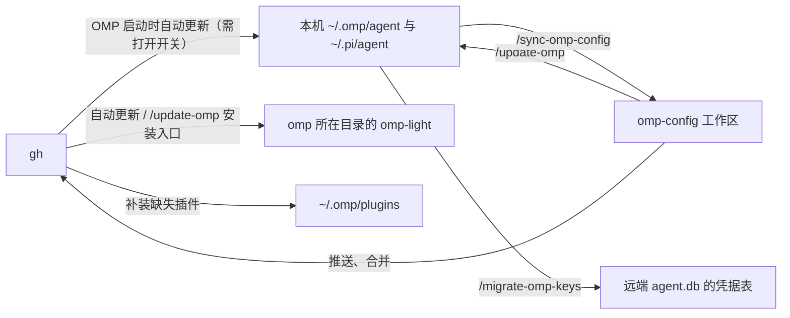

# omp-config

Oh My Pi（OMP）配置中可以审查、可以迁移的部分，为重型编程场景定制。这里不是 `~/.omp` 的完整备份：数据库、会话、缓存、日志、锁文件和凭据都不进仓库。

- [仓库内容](#仓库内容)
- [快速上手](#快速上手)
- [设计思路](#设计思路)
- [同步与迁移](#同步与迁移)
- [轻量模式](#轻量模式)
- [Subagent 体系](#subagent-体系)
- [本地扩展](#本地扩展)
- [维护须知](#维护须知)

## 仓库内容

|路径|内容|本机位置|
|---|---|---|
|`agent/config.yml`|OMP 配置、UI 行为、subagent 模型绑定|`~/.omp/agent/`|
|`agent/APPEND_SYSTEM.md`|完整模式的追加系统提示词|`~/.omp/agent/`|
|`agent/APPEND_SYSTEM_MODEL.md`|[append-system-model](#append-system-model) 按模型追加的系统提示词；本机建了才有|`~/.omp/agent/`|
|`agent/config-light.yml`、`agent/APPEND_SYSTEM_LIGHT.md`、`agent/omp-light.ts`|轻量模式的配置覆盖、追加提示词（目前为空）、入口源码|`~/.omp/agent/`|
|`agent/omp-config-update.ts`|仓库 → 本机的更新器，[启动时自动更新](#启动时自动更新)和 `/update-omp` 共用|`~/.omp/agent/`|
|`agent/thinking-translator.json`|`omp-thinking-translator` 插件配置|`~/.omp/agent/`|
|`agent/PROMPT-INJECT-*.md`|[user-prompt-inject](#user-prompt-inject) 的模板：把用户原话注入 mentor 和 discussant|`~/.omp/agent/`|
|`agent/agents/`|subagent 定义；`README.txt` 记录编写陷阱|`~/.omp/agent/agents/`|
|`agent/extensions/`|本地扩展，以及 `lang-nag.json`、`input-polish.json`、`doc-polish.json` 三个扩展配置|`~/.omp/agent/extensions/`|
|`agent/extensions-last/`|必须最后加载的扩展，由 `config.yml` 的 `extensions` 末项显式加载；目前只有 [system-prompt-replace](#system-prompt-replace)|`~/.omp/agent/extensions-last/`|
|`agent/system-prompt-replace.json`|[system-prompt-replace](#system-prompt-replace) 的替换规则|`~/.omp/agent/`|
|`pi/agent/pi-bansos-relay-state.json`|`pi-bansos` 插件状态|`~/.pi/agent/`|
|`install-plugins.sh`、`plugin-audit.sh`|插件安装、插件漂移检查|—|
|`.omp/commands/`|三个维护命令的完整规则|—|
|`ci/`、`.github/workflows/config-check.yml`|配置检查（CI）：脚本、设计与判据见 `ci/README.md`|—|

## 快速上手

以下命令都在仓库根目录启动 OMP 后执行。

**新机器：**

1. 执行 [`/update-omp`](#update-omp仓库--本机)：把配置写进本机（包括更新器 `omp-config-update.ts` 和 [omp-config-autoupdate](#omp-config-autoupdate) 扩展），安装 `omp-light`，补装缺少的插件。
2. 要在 OMP 里用 Claude Code 的 skills、rules、commands 等时，在本机 `~/.omp/agent/config.yml` 的 `extensions` 开头加一项 `~/.claude`。OMP 把它当扩展包根目录，加载其中的 `skills/`、`rules/`、`commands/`、`hooks/` 等。这一项属于本机：更新器保留，`/sync-omp-config` 不写回仓库，`omp-light` 也加载它，见[两个方向共同的规则](#两个方向共同的规则)。没有 `~/.claude` 的机器不要加，否则每次启动都报加载失败。
3. 重启 OMP。追加提示词、扩展和插件都在启动时加载。
4. 需要每次启动都从 GitHub 默认分支[自动更新](#启动时自动更新)时，执行 `/omp-config-autoupdate on`（默认关闭），从下次启动起生效；之后就不用再手动执行 `/update-omp`。
5. 按[迁移后检查](#迁移后检查)确认结果。
6. 需要沿用旧机器的供应商登录时，在旧机器上执行 [`/migrate-omp-keys <新机器>`](#凭据迁移migrate-omp-keys-target)。

**本机改了配置，要收回仓库：** 先执行 `/sync-omp-config check` 查看差异，再执行 [`/sync-omp-config`](#sync-omp-config本机--仓库) 写入仓库，并提交、推送。自动更新开着时，默认分支一有新提交，下次启动就会用仓库版本覆盖本机的托管项，没收回仓库的改动会丢失。

## 设计思路

### 定位

- 不是 ultracode 式的大型任务求解器，这类需求由其他插件实现。
- 完整 prompt 不考虑简单小任务。措辞一放松，模型就会逃避困难模式，所以 prompt 基本不给退路。附带的定制对小任务也没多大用处。小任务用[轻量模式](#轻量模式)。

### 约束模型行为

这套约束不假设模型会稳定遵循 system prompt。实际使用中，以 Claude 为首的模型会选择性执行其中的规则；一旦开始绕开工具调用规范，其他约束（包括 `CLAUDE.md` 和 `*.rule.md`）也往往一起失效。仓库因此同时约束副作用、检测偏离，并在运行时补充提醒。

**用 hashline edit 约束副作用。** hashline edit 要求先读取当前文件，再明确指定编辑范围；写操作因此绑定到已经观察过的快照，而不是依赖模型确信自己的一次性命令不会出错。这能降低并发修改后的误写和覆盖风险。具体规范见 `agent/APPEND_SYSTEM.md` 的 `# Tool Call`。

**在完整模式中，把 todo 与 ctx 作为一套联合工具。** todo 负责维护任务生命周期；OMP 的原生机制会在普通结束路径上发现 todo 尚未完成时要求 agent 继续，因此不必靠 loop 反复注入 prompt。它也会减少因小挫折而过早询问用户：没有明确标记为 blocked 的任务继续由 agent 处理。自动继续存在误判风险，但这里选择承担这项风险，而不是频繁中断操作员。

每次成功的 todo 修改都会被 `ctx-tasklog` 捕获；`ctx` 按这些事件重放任务的最终状态，形成不依赖模型自行总结的简短行事记录。主会话发生 compact 后，`ctx-post-compact-hint` 会把这份记录连同 context 树强制注入新 context。OMP 原生不给 subagent todo，[subagent-todo](#subagent-todo) 为 `task:*` worker 补上该工具，使从 todo、task log 到 ctx 的同一条链路覆盖 subagent；worker 定义同时要求每个切片都维护自己的 todo。

**把非法工具调用当作整体偏离的信号。** [tool-policy-nag](#tool-policy-nag) 检测模型是否绕开内置工具，只计数和提醒，不拦截命令。目标不是追求形式上完美的“古典”工具调用，而是在偏离扩散到其他规则之前及时校正。

**用 watchdog 做独立的运行时审阅。** watchdog 作为第三方观察者自动读取 context，并按规则注入提醒；作用类似 Claude 的 `/advisor`，但目标、触发和投放方式更广。判定选项较少时，同一个 watchdog 可以改用 Jev 后端（[watchdog-agent](#watchdog-agent)）。

**让顾问看到用户原话。** mentor 和 discussant 只知道派它的 agent 告诉它的东西，只能顺着对方的转述给意见，成了回声放大器。[user-prompt-inject](#user-prompt-inject) 把根会话里用户自己写的 prompt 按模板注入它们的每次模型调用，让它们拿用户的目标和约束去核对对方的计划，而不是核对对方的转述。

**单独补偿语言设置丢失。** Claude 的 server compact 之后，重新注入的 system prompt 可能没有恢复语言约束。[lang-nag](#lang-nag) 因此独立检查回复语言，并在下一次输入前补充提醒；它不改写已经发出的回复。

### Context 管理

**把 context 视为意图状态。** context 不只是文件内容，还包含需求、取舍、已确认的事实，以及与人类对齐过的意图。compact 会压缩这些信息，所以长程任务中的每次 compact 都是高损耗操作，应尽量避免。

不能用同样有损的手段换取表面上的 context 节省：

- 用 grep 代替完整阅读，会让片面信息固化成错误认识。
- 把许多操作拼成一次长 bash，会扩大副作用并降低失败时的可判断性。
- 外部命令的输出量可能失控；例如 git 分支经过多轮迭代后可达数百条，但直接用 `head` 或 `tail` 截断同样会丢失关键证据。

应优先使用工具自带的分页和默认排序，在控制输出规模的同时保留可追溯的读取边界。

**把可丢弃的工作放进 subagent context。** subagent 的 context 是可抛弃的工作分支；重要结论和证据通过 subagent IRC 返回，由主 agent 整理并写回自己的 context。这样丢弃的是执行过程，不是任务意图。

**由意图负责人写文档和核心代码。** 代码任务中，文档和核心代码是设计意图的主要载体，因此每一层的当前负责人必须亲自完成，不能把设计责任下放给 worker。完整规则见 `agent/APPEND_SYSTEM.md` 的 `# Operating stance`。

**需要完整背景时 fork context。** 即使超过 150 万字的纯设计材料能够一次装入 context，也不适合让一个会话承担全部实现。把现有 context fork 给 subagent，可以让它聚焦局部任务，同时保留文件之外、已经与人类对齐的意图；这正是 `fork_task` 对原有 `task` 的补充（[fork-task](#fork-task)）。如果主 context 最终仍发生 compact，ctx 联合链路会把 context 树和由 todo 重放得到的任务记录强制注入压缩后的会话；它恢复的是已记录的进度，不是假定压缩能够无损保留原始意图。

### Subagent 分档

模型的代码生成能力不等于整体判断力、规划能力或约束遵循能力。有些模型不适合由人类直接驱动，却能在边界明确的切片中成为高效 worker；task 分档据此区分成本与所需可信度。显式能力标签又可能影响 agent 的选择偏好，而实际费用同样会影响派发，所以能力描述刻意保持模糊（见 [Subagent 体系](#subagent-体系)）。

低阶模型还可能在工作未完成时直接交付。[task-completion-judge](#task-completion-judge) 在这类 worker 交付前检查完成度；[task-split-check](#task-split-check) 推动每次派发只覆盖一个主题，以降低验收和核对成本。

### 其余扩展

其余扩展大多是补丁，或是对某个工具的补充，可有可无。

## 同步与迁移



仓库 → 本机有两条路：打开[启动时自动更新](#启动时自动更新)后由它在启动时完成，不打开就手动执行 `/update-omp`。三个命令在仓库根目录启动 OMP 后执行，完整规则见 `.omp/commands/` 下的同名文件。

|命令|方向|写入|加 `check`|
|---|---|---|---|
|`/update-omp`|仓库工作区 → 本机|本机配置、`omp-light` 入口、缺失的插件|只报告差异，不写入|
|`/sync-omp-config`|本机 → 仓库|只写仓库，完整模式会提交并推送|只报告差异，不写入|
|`/migrate-omp-keys <target>`|本机 → 远端主机|覆盖远端凭据|—|

### 两个方向共同的规则

- **结构化配置按字段处理。** `config.yml`、`thinking-translator.json`、`system-prompt-replace.json`、`extensions/lang-nag.json`、`extensions/input-polish.json`、`pi-bansos-relay-state.json` 都按字段比对，只改有差异的字段。`/sync-omp-config` 写仓库时只改这些行，不整文件覆盖，也不重新序列化。仓库 → 本机由更新器写入：合并结果与仓库文件完全一致时原样复制仓库文件，否则重新序列化整个文件（键的顺序不变，格式可能与原文件不同）。两端都必须能解析：YAML 用 `Bun.YAML.parse`，JSON 用 `JSON.parse`。
- **`config.yml` 的本机字段两个方向都不动**，例如 `modelRoles`、`theme`、`compaction.thresholdTokens`，完整列表是 `agent/omp-config-update.ts` 的 `LOCAL_CONFIG_FIELDS`。
- **`config.yml` 的 `extensions` 由仓库和本机共用**（`agent/omp-config-update.ts` 的 `MACHINE_LIST_FIELDS`）：仓库列表里的条目归仓库，仓库列表里没有的条目（如 `~/.claude`）归本机。更新器把本机条目留在仓库条目前面，所以 `extensions-last/` 下的扩展仍是最后一项；`/sync-omp-config` 不把本机条目写回仓库。仓库删掉自己的条目时，自动更新照常删掉它（见下面的“删除”）。
- **本机的 `settings.json` 不迁移**：`config.yml` 存在时 OMP 不读它的 `extensions`。
- **应用托管的扩展两个方向都跳过**：首行为 `// @orca-managed-pi-extension`，或任意位置含 `marker: _otty`。以标记为准，不看文件名。这类文件（如 `orca-*.ts`、`otty-integration.ts`）由 Orca、Otty 自己安装和改写。
- **运行时文件不迁移**：`*.db*`、WAL、`*.lock`、`models.yml`（含 API key）、`commandcode-models.json`（本机生成）、`last-changelog-version`、`sessions/`、`terminal-sessions/`、`blobs/`、`cache/`、日志，以及自动更新的记录 `.omp-config-applied`。

### 启动时自动更新

[omp-config-autoupdate](#omp-config-autoupdate) 扩展在 OMP 启动时运行更新器 `omp-config-update.ts auto`。默认关闭，用 `/omp-config-autoupdate on` 打开、`off` 关闭，开关只属于本机，见该扩展一节。仓库对托管项说了算：本机绕过仓库直接改了托管文件或托管字段，下次更新时会被覆盖。除此之外，本机自己的东西一律不动。

1. **取仓库**：更新器在 `~/.omp/omp-config-src` 维护一份自己的浅克隆，从 `https://github.com/mouriya-s-lab/omp-config.git` 拉 `master` 分支（仓库的默认分支，写死在更新器的 `DEFAULT_BRANCH` 里）。这个目录存在但不是这个仓库的克隆时不碰它，直接报错。拉取失败（如断网，包括还没有克隆时的首次克隆失败）时这次不更新：克隆只是上次拉取时的副本，不能代替 GitHub 上的默认分支，下次启动再拉。
2. **只在提交变化时应用**：新提交和 `<agent 目录>/.omp-config-applied` 记录的上次应用提交相同就什么都不做，所以没有新提交时，`/settings`、`/bansos` 改过的托管值不会被每次启动改回去。应用规则取自新提交里的 `omp-config-update.ts`，改了更新规则的提交按自己的规则应用。
3. **写入**：先校验所有结构化配置能解析成映射，有一个不行就整次不写。然后依次写普通文件、JSON、`config.yml`，最后做删除。每个文件先写同目录临时文件再 rename；目标是 symlink 时写到它指向的文件，symlink 保留。
4. **删除**：只删 git 记录的“上次应用的提交 → 新提交”之间仓库删掉的托管文件、结构化配置里仓库删掉的键，以及 `extensions` 里仓库删掉的条目。仓库删掉一整个映射时，只删其中仓库原有的键，本机自己加的键和本机字段留下；删完为空才删掉这个映射。仓库删掉整个结构化配置文件时，本机的文件不动。没有上次记录（首次运行）或旧提交已经不在克隆里时，什么都不删。
5. **插件**：`install-plugins.sh` 里有、`~/.omp/plugins/package.json` 里没有的插件，用 `omp install` 补装。从不卸载。
6. **轻量入口**：和 `/update-omp` 一样，把 `omp-light` 装到 PATH 上 `omp` 所在的目录。
7. **记录**：没有任何错误才把新提交写进 `.omp-config-applied`；有错误就保持旧记录，下次启动重试。

不动的东西：

- `config.yml` 里仓库没有的键和本机字段，`extensions` 里仓库列表没有、也不是仓库刚删掉的条目，结构化配置里只有本机才有的键。本机字段即使本机没有，也不从仓库补；仓库把本机字段的上级键改成非映射值时，本机的映射保留。例外：仓库把自己的某个键从映射改成标量时以仓库为准，本机在这个映射下加的键随之消失。
- 托管范围以外的文件：本机多出来的扩展、agent、模板，`extensions/doc-polish.json` 等初始化项，运行时状态。
- 应用托管的文件：每次覆盖和删除前都检查标记，结构化配置也一样。
- 本机解析不了的结构化配置：不覆盖，记为错误，下次启动重试。

**并发**：更新器用锁目录 `~/.omp/omp-config-update.lock` 把“拉取 + 应用”串行化，同时启动的其他 OMP 和 `/update-omp` 拿不到锁就跳过。锁里记着持有者的 pid：持有进程已经退出的锁视为残留，可以抢占；进程只释放自己持有的锁。

**生效时机**：更新在当前会话运行期间落地。`config.yml` 实时重载，`APPEND_SYSTEM_MODEL.md`、`system-prompt-replace.json`、`PROMPT-INJECT-*.md`、`agents/` 从下一条 prompt 或下一次派发开始生效。`APPEND_SYSTEM.md`、扩展（包括这个扩展本身）和插件要到下次启动；有这类改动时，通知会提醒重启。也就是说，同一个会话里可能暂时是新数据配旧扩展代码，重启后一致。

**通知**：有改动时弹一条 info，说明更新到哪个提交、写了几个、删了几个、补装了几个插件；失败时弹 warning。已是最新、拉取失败、锁被占用这三种情况只写日志。headless 模式不弹通知，只写日志。通知只给汇总；`/omp-config-autoupdate run` 的详细报告只列它自己那次运行的结果：启动时已成功应用的更新，再 `run` 只会报告已是最新；启动时应用出错（不写 `.omp-config-applied`）时，`run` 会重新应用并逐条列出，见 [omp-config-autoupdate](#omp-config-autoupdate)。一直拉取失败时启动不会提醒，用 `run` 看 git 报错。

### `/update-omp`：仓库 → 本机

用工作区（含未推送的改动）手动更新一次：`bun agent/omp-config-update.ts apply --source .`，写入规则与自动更新相同。没打开自动更新时，仓库 → 本机就靠它；打开了的话，新机器首次安装更新器、想先在本机试用未推送的改动时用它。和自动更新的差别：

- 不删文件，也不删结构化配置里的键：工作区没有“上次应用的提交”可以对比。
- 不改写 `.omp-config-applied`。自动更新开着时，下次启动只要默认分支的提交与记录不同，就会覆盖手动应用的内容；改动推送并合并后再启动，两边就一致了。
- 用 `./plugin-audit.sh` 找出 `[卸载候选]`，询问后卸载；缺失的插件由更新器补装。
- 本机初始化项已存在就不动，缺失时先问用户是否创建、内容填什么，没确认就跳过并在报告里说明：`extensions/doc-polish.json`、[commandcode-model-spec](#commandcode-model-spec) 依赖的 `commandcode-models.json`。自动更新从不创建它们。

完成后报告改了哪些文件、装卸了哪些插件、哪些项因等待确认被跳过，并提醒重启 OMP。`pi-bansos-relay-state.json` 在已运行的会话里要到下次会话启动，或下一次用 `/bansos` 修改时才生效。

### `/sync-omp-config`：本机 → 仓库

只读本机，不写 `~/.omp`、`~/.pi`、`omp` 安装目录、PATH 或 shell 配置，本机文件的 mtime 前后不变。

- **范围**：`config.yml`、`APPEND_SYSTEM.md`、`APPEND_SYSTEM_MODEL.md`、`thinking-translator.json`、`system-prompt-replace.json`、`PROMPT-INJECT-*.md`、轻量模式三项资产、`omp-config-update.ts`、`agents/`、`extensions/*.ts`、`extensions-last/*.ts`、`extensions/lang-nag.json`、`extensions/input-polish.json`，以及 `~/.pi/agent/pi-bansos-relay-state.json`。与更新器的托管范围一致。`config.yml` 的本机字段和 `extensions` 的本机条目不写回仓库。
- **不收回**：安装到 `omp` 旁边的 `omp-light` / `omp-light.cmd`（轻量模式三项只从 `~/.omp/agent` 取）；`extensions/doc-polish.json`；`.omp-config-applied`；自动更新的开关 `omp-config-autoupdate.json`。
- 本机没有 `pi-bansos-relay-state.json`（从没用 `/bansos` 改过设置）时，不算“本机已删除”，仓库保持原样。
- `~/.omp/plugins/package.json` 的依赖和 `install-plugins.sh` 不一致时，重写脚本里的插件列表：URL/Git 依赖原样保留，npm 依赖去掉版本号；注释掉的可选插件保持注释，见[插件](#插件)。
- 写入仓库后校验：普通文件与本机 `cmp` 一致，结构化配置除本机字段外逐字段一致，YAML/JSON 能解析，仓库里没有明文凭据（`sk-`、`ghp_`、超长的 `apiKey:` 值），`git status --short` 里没有运行时文件或已安装入口。
- 完整模式最后提交并推送，commit message 为 `chore: sync snapshot with local omp config`。

### 插件

插件包是运行时状态，不进仓库（仓库只收 `pi-bansos` 的状态文件，见[手动迁移](#手动迁移)）。`install-plugins.sh` 声明插件列表，并对每一项执行 `omp install`：

- npm：`pi-commandcode-provider`、`pi-package-search`、`pi-pretty-codeblocks`、`pi-schedule`。
- GitHub：`mouriya-s-lab/pi-bansos`、`mouriya-s-lab/omp-unified-exec`、`Mouriya-Emma/omp-thinking-translator`、`mouriya-s-lab/omp-codex-image-gen`。
- 可选，注释掉、默认不装：`mouriya-s-lab/omp-remote-build`，给每个 git worktree 在远端 Docker 主机上建 Mutagen 副本和 Komodo 管理的构建容器。不是谁都需要，而且依赖太多：`omp-unified-exec`、Mutagen、km CLI、Komodo Core/Periphery 和可 SSH 的构建主机，配置见它仓库的 README。需要时给该行加上单引号取消注释。

所有插件都不钉版本：npm 包由 OMP 解析当前版本，GitHub URL 跟随默认分支，重复执行可能升级插件。结果写进 `~/.omp/plugins/`（`package.json`、`bun.lock`、`node_modules/`、`omp-plugins.lock.json`）。脚本需要联网，会下载并加载第三方代码。

`pi-bansos` 用的是 `mouriya-s-lab` 的 fork，其中的修复也提交给了上游。本机已经装了 npm 版 `pi-bansos` 时，要先 `omp plugin uninstall pi-bansos`，再装 fork。

`omp-unified-exec` 是 `mouriya-s-lab` 对 `iamwrm/pi-unified-exec` 的 fork，提供 `exec_command`、`write_stdin` 等工具。上游 0.12.1 起直接导入 pi 的 `createCodemodeExtension`，OMP 没有 codemode，插件校验失败、装不上；fork 改成宿主没有这个导出时跳过这项显示优化，并把包名改成 `omp-unified-exec`。在 Bun 1.4 及以上版本中，TTY 由 Bun 原生 `Terminal` 实现，macOS、Linux、Windows 共用同一后端；在 Node.js 中才按需加载 `@homebridge/node-pty-prebuilt-multiarch`。定制清单和同步方式记在 fork 仓库的 `fork-features/README.md`。本机装着 `pi-unified-exec` 时，要先 `omp plugin uninstall pi-unified-exec`，再装 fork：两者注册同名工具。

`./plugin-audit.sh` 只读，从基准提交 `5974c4fa` 起收集 `install-plugins.sh` 里出现过的插件，和 `omp plugin list` 对比后分类。它只认插件列表里带单引号的条目，注释掉的可选插件不算登记，本机装了也归 `[保留]`。它读的都是已提交的版本（`git show <commit>:install-plugins.sh`，“当前列表”取 `HEAD`），而 `./install-plugins.sh` 运行的是工作区里的文件，所以改了插件列表要先提交再跑 audit。仓库 → 本机按分类处理：

|分类|含义|处理|
|---|---|---|
|`[安装]`|脚本要求、本机缺失|更新器补装（自动更新和 `/update-omp` 都会）。更新器按 `~/.omp/plugins/package.json` 判断缺失：GitHub 条目比去掉 `#ref` 的 URL（本机钉在某个分支或提交上也算已装，不会被改回默认分支），npm 条目比包名|
|`[卸载候选]`|从脚本删掉了，本机还装着|只有 `/update-omp` 处理：询问后 `omp plugin uninstall <name>`；自动更新从不卸载|
|`[保留]`|用户自己装的，脚本从没登记过|不动|
|`[已同步]`|脚本与本机一致|—|

GitHub URL 的插件名按 URL 最后一段推断，仓库名和包名不同时分类可能有偏差，以 `omp plugin list` 的名称为准。

### 手动迁移

不走 `/update-omp` 时，只复制下面的文件集，不要复制整个 `agent/`：里面还有运行时状态、`models.yml` 和 `commandcode-models.json`。这是整文件复制，会用仓库版本覆盖目标机的 `config.yml`（包括本机字段，如 `compaction.thresholdTokens`，以及 `extensions` 的本机条目，如 `~/.claude`）和 `extensions/doc-polish.json`，也会带上只给仓库看的 `extensions-last/README.md`；目标机已有配置时改用 `/update-omp`，或复制后恢复这些本机内容。先备份目标机，检查差异，然后：

```bash
mkdir -p "$HOME/.omp/agent"
cp agent/config.yml agent/APPEND_SYSTEM.md \
  agent/thinking-translator.json agent/system-prompt-replace.json agent/PROMPT-INJECT-*.md \
  agent/config-light.yml agent/APPEND_SYSTEM_LIGHT.md agent/omp-light.ts agent/omp-config-update.ts \
  "$HOME/.omp/agent/"
cp -a agent/agents agent/extensions agent/extensions-last "$HOME/.omp/agent/"
[ -f agent/APPEND_SYSTEM_MODEL.md ] && cp agent/APPEND_SYSTEM_MODEL.md "$HOME/.omp/agent/"
mkdir -p "$HOME/.pi/agent"
cp pi/agent/pi-bansos-relay-state.json "$HOME/.pi/agent/"
./install-plugins.sh
```

复制完重启 OMP。只复制文件不会让 `omp-light` 可用：在目标机执行一次 `/update-omp`，它会把 `omp-light` 装到 PATH 上 `omp` 所在的目录（`omp` 必须已在 PATH 上）。也可以执行 `/omp-config-autoupdate on` 后再重启：第一次自动更新时还没有 `.omp-config-applied`，会按默认分支完整应用一次，同样安装 `omp-light` 并补装缺失的插件。首次应用改动的扩展和补装的插件要再重启一次才加载，通知会提醒。

`pi-bansos-relay-state.json` 放在 `~/.pi/agent/` 而不是 `~/.omp/agent/`，因为插件从那里读。它记录 relay 开关、当前 relay、已保存的 relay 列表和状态栏设置，由 `/bansos` 写入，不含凭据。状态栏默认显示 `relay: ON/OFF`；隐藏设置（`statusBar: "hidden"`）只存在这个文件里，缺了它，新机器会重新显示。

### 迁移后检查

```bash
omp config list --json
omp plugin list --json
git status --short
```

确认配置值、插件名称、版本、路径和 `enabled` 状态符合预期，第三方插件没有带进不需要的扩展，仓库里没有出现数据库、WAL、日志、会话、缓存或插件运行时文件。

### 凭据迁移：`/migrate-omp-keys <target>`

换机器后不用重新登录各个供应商：把本机 `~/.omp/agent/agent.db` 的 `auth_credentials` 表经 SSH 复制到远端同路径的 `agent.db`。这条路径与仓库快照无关，仓库仍然不收数据库。

- `target` 是一个 SSH 地址（`user@host` 或 alias）。没给就先问，问不到就停止，不碰数据库。
- 覆盖远端已有凭据：写之前说明并确认，用 SQLite `.backup` 给远端库做带时间戳的备份。
- 远端 OMP 先关掉，迁完手动重启；命令本身不启停 OMP。
- 只迁凭据表，不迁会话、历史、缓存或模型。不轮换密钥，不打印凭据。

## 轻量模式

`omp-light` 启动一个精简的 OMP 进程，适合简单小任务：

- 用 `APPEND_SYSTEM_LIGHT.md` 代替完整的追加提示词。
- 按 `config-light.yml` 禁用 12 个行为扩展：`ctx-post-compact-hint`、`ctx-tasklog`、`ctx-tool`、`doc-polish`、`fork-task`、`isolation-nudge`、`lang-nag`、`task-completion-judge`、`task-split-check`、`tool-policy-nag`、`user-prompt-inject`、`watchdog-agent`。
- 其余 7 个扩展照常加载：`append-system-model`、`bro`、`input-polish`、`repo-rules`、`subagent-todo`、[omp-config-autoupdate](#omp-config-autoupdate)，以及兼容性修复 `commandcode-model-spec`。`APPEND_SYSTEM_MODEL.md` 因此在轻量模式下照样注入；自动更新开着时，用 `omp-light` 启动也会更新。
- `config-light.yml` 把 `extensions` 覆盖成空列表，去掉 `config.yml` 末项的 [system-prompt-replace](#system-prompt-replace)。`disabledExtensions` 只过滤按模块名发现的扩展，管不到 `config.yml` 里按路径加载的项，所以只能这样排除。覆盖会连带去掉本机条目（如 `~/.claude`），所以 `omp-light` 读本机 `config.yml`，把 `extensions` 里不在 `extensions-last/` 下的条目逐个用 `-e` 传给 `omp`；`-e` 是另一条加载通道，不受这个覆盖影响。`extensions-last/` 下的扩展因此只属于完整模式。
- 插件、rules、skills、上下文文件，以及 model、thinking、profile、auth、session 设置都不变。被禁用扩展注册的工具（`ctx`、`polish_doc`、`fork_task`）在轻量模式下不存在。
- `omp-light` 从 agent 目录读 `config-light.yml` 和 `APPEND_SYSTEM_LIGHT.md`：设置了 `PI_CODING_AGENT_DIR` 时用它，否则用 `~/.omp/agent`。缺任何一个就直接退出，不回退到别的目录。
- `omp-light` 后面的参数原样传给 `omp`，可以覆盖入口预设的同名参数。

这些覆盖只对这一个进程有效，不改任何文件；文件只由自动更新写入，和完整模式相同。直接运行 `omp` 就是完整模式。

**安装。** 自动更新和 `/update-omp` 都把 `agent/omp-light.ts` 安装到 PATH 上 `omp` 所在的目录，所以不用改 PATH，也不用建 symlink：

- POSIX（macOS、Linux）：可执行文件 `omp-light`，内容就是 `omp-light.ts`，靠 `#!/usr/bin/env bun` 运行，bash、zsh、fish、Unix `pwsh` 通用。
- Windows：`omp-light.ts` 加一个生成的 `omp-light.cmd`，PowerShell 通过 `.cmd` 启动。

安装出来的入口不属于仓库。内容和权限与仓库一致时不重写；`/update-omp check` 列出需要重写的入口。写入后 PATH 上解析到的 `omp-light` 不是刚装的那个时，报告遮住它的旧副本，但不修复。

## Subagent 体系

subagent 分三类：`task:*` 执行，`discuss:*` 只读讨论，`mentor:default` 只读指导。

### 改哪里

|要改的|位置|
|---|---|
|编排流程、各类 agent 如何配合|`agent/APPEND_SYSTEM.md`|
|某个 agent 的职责（`description`）和它自己的角色提示（正文）|`agent/agents/<name>.md`|
|注入给某些 agent 的用户原话模板|`agent/PROMPT-INJECT-*.md`，见 [user-prompt-inject](#user-prompt-inject)|
|模型、推理强度、运行开关、禁用入口|`agent/config.yml`|

harness 会把 `APPEND_SYSTEM.md` 和每个 agent 的 `description` 都注入主 agent，所以两处不写重复内容。subagent 收不到 `APPEND_SYSTEM.md`，它需要的规则写在自己的定义里。

改 agent 定义前先读 `agent/agents/README.txt`，里面是实测过的陷阱：`spawns` 的默认值、`task.disabledAgents` 里的名字即使列进 allowlist 也派不出去、递归深度上限、只有 `yield` 的 agent 会丢答案、目录里的非 agent `.md` 会被当成定义解析等。改动在下次派发时生效，不用重启；已经在跑的 subagent 不受影响。

### 分档

下表第二列是各 agent `description` 里的说法，也就是主 agent 看到的档次与成本；实际模型在 `config.yml` 的 `task.agentModelOverrides`。换模型不改变 agent 的职责，但要同步它 `description` 里和本表中的档次与成本。

|名称|`description` 里的档次与成本（每 1M token，综合）|可派发|用途|
|---|---|---|---|
|`task:high`|Claude Opus 5.5，约 0.45 USD|全部 `task:*`、两个 discussant、mentor|必须一次做对，或更便宜的档次裁决不了的工作；负责所派子批次的契约、验收与集成|
|`task:mid`|Opus 级，约 0.3 USD|mentor|默认档次：委派的实现、调查、调试和验证；也裁决便宜档次之间的冲突|
|`task:low`|Opus 级，约 0.01 USD|mentor|成本优先、结果可以直接交付的工作：批量机械改动、查询、例行检查；也负责验证 `task:free` 的结果|
|`task:free`|Opus 级，零成本，并发几乎不限|mentor|结果不需要独立验证的工作：找候选代码或文档、列方案、探索性试验|
|`discuss:divergent`|—|—|发散视角：找问题边界之外的替代方案及其代价|
|`discuss:steady`|—|—|保守视角：查风险、隐藏假设、遗漏状态和更简单的方案|
|`mentor:default`|—|—|无工具导师：调查前审计划，调查后核对证据和遗漏|

### 派发规则

- **按成本和所需可信度选档次，不按难度选。** 默认派 `task:mid`；成本比多出的判断力更重要时（批量机械改动、查询、验证 `task:free`）降到 `task:low`。验证也算成本：需要验证才能采信的结果，用 `task:free` 加验证者比 `task:low` 做一次更贵。进仓库的改动、会被直接采信的结论和裁决都给 `task:low` 及以上。`task:free` 的结果不能互相验证。
- **`task:free`、`task:low`、`task:mid` 不接设计和核心工作**：架构、领域类型与状态模型、接口与跨切片契约、改动的核心逻辑，以及文档、prompt、skill、agent 定义的设计。`task:high` 没有这条限制。
- **核心代码、小改动和文档设计由当前负责人自己写**，不交给任何 `task:*`。小改动按整件工作判断：写派工单不比直接改省事，就自己改。
- **其余工作切成最小、各有验收标准的单元，一次并行派出。** 单元能并行的条件：各有验收标准、启动不依赖其他单元的输出、文件和状态归属不重叠。只因接口或文件边界没定而不满足的，先定边界再并行。确实拆不开的，主 agent 交给一个 worker，worker 则自己做。
- **只有 `task:high` 能派 worker**，因为切单元、定验收、划文件归属本身就是契约设计。递归最多两层：`task:high` 派出的孙代只能接可直接执行的叶子任务，也派不出 mentor。
- **派发必须写明 `agent`。** 省略时会落到 allowlist 的第一项或被禁用的内置 agent 上。
- **派发不覆盖 `effort`。** 选 tier 就是选它在 `config.yml` 里的模型绑定，不算改模型；原生 `task` 没有 `model`、`effort` 参数，`fork_task` 的 `effort` 除非用户明确要求不填。这条写在 `fork-task.ts` 的 `fork_task` 工具说明里，`task:high` 定义里也有同一条，用户的要求要经派工单转达给它。
- **worker 自测不算验收。** 派发方要检查产物和执行证据，自己做跨切片的集成检查；复杂验收交给没写这部分代码的独立 agent。重要决定同时问两个 discussant。

每个 `task:*` worker 的定义还要求：

- 动手前先读实际代码、写出计划，交给自己的 `mentor:default` 过一遍；处在递归上限、没有 `task` 工具时跳过这一步。
- 每个切片都用 todo（工具由 [subagent-todo](#subagent-todo) 提供）：改动前用计划的全部步骤 `init`，状态一变就更新；还有未完成项时不 `yield`；只有等待外部回复才算 block，不许用 `drop` / `rm` 缩小范围。

### 并行写入的隔离

隔离由派发方每次决定，不写在 agent 定义里：

- 不带 `isolated: true` 的 `task:*` 在派发方的目录里运行。同一仓库同时有两个以上写入者（同一批，或前一个还在跑）时，每个写入者都要 `isolated: true`。只做调查的保持共享，结束后还能用 `write agent://<id>` 续聊。
- `fork_task` 默认就是隔离的，只调查时显式写 `isolated: false`。
- 给隔离 worker 的路径写成仓库相对路径。OMP 的隔离只靠提示约束，绝对路径会让 worker 的命令跑回派发方的目录。
- 隔离 worker 完成不等于改动已落地：结果显示 `Applied patches: yes` 才算应用；失败或中止的隔离运行不保留改动。
- 隔离不能代替划分文件归属，改动重叠只会变成应用失败的 patch。
- 规则分布：派发方的规则写在 `APPEND_SYSTEM.md` 和 `task-high.md`；worker 在隔离工作树里的路径规则写在四个 `task-*.md` 里。模型忘了隔离时，[isolation-nudge](#isolation-nudge) 拦一次作提醒。

### 内置的 `task` 和 `sonic`

`task` 和 `sonic` 是 OMP 内置 subagent，不在 `agent/agents/` 里，并且列在 `task.disabledAgents` 中。Vibe 模式的第一层派发固定用它们，所以 `config.yml` 只为这个场景保留它们的模型覆盖，常规任务不用。

## 本地扩展

`agent/extensions/` 和 `agent/extensions-last/` 里的扩展修补 OMP 和插件的缺陷，或补充行为约束、上下文恢复、派发检查、配置同步等能力。“轻量”列表示[轻量模式](#轻量模式)下是否加载。

|扩展|作用|轻量|
|---|---|---|
|[tool-policy-nag](#tool-policy-nag)|发现用 shell/eval 代替内置工具时计数并提醒|否|
|[watchdog-agent](#watchdog-agent)|按目标投放的第三方审查者|否|
|[user-prompt-inject](#user-prompt-inject)|按模板把用户原话注入指定的 subagent|否|
|[lang-nag](#lang-nag)|回复语言不对时，在下一条输入前加提醒|否|
|[repo-rules](#repo-rules)|补读 `.claude/rules` 等 repo 级 rule 目录|是|
|[append-system-model](#append-system-model)|按模型 / 提供商正则追加系统提示词|是|
|[system-prompt-replace](#system-prompt-replace)|在按路径加载的扩展里最后执行，按 JSON 规则替换 system prompt 文字，用来改写内置工具说明|否|
|[fork-task](#fork-task)|注册 `fork_task`：带着当前对话副本派 subagent|否|
|[isolation-nudge](#isolation-nudge)|多个写入者共用目录时拦一次|否|
|[task-split-check](#task-split-check)|拦下多主题派发和限制汇报长度的派发|否|
|[subagent-todo](#subagent-todo)|给 `task:*` worker 补上 `todo`，接入 todo / ctx 联合链路|是|
|[task-completion-judge](#task-completion-judge)|worker 交付前审一次完成度|否|
|[ctx-tool](#ctx-tool)|注册只读 `ctx` 工具，汇总上下文树并重放 todo 行事记录|否|
|[ctx-tasklog](#ctx-tasklog)|捕获成功的 todo / goal 修改，形成 `ctx` 的派生记录|否|
|[ctx-post-compact-hint](#ctx-post-compact-hint)|compact 后强制注入 `ctx` 概览和当前任务记录|否|
|[doc-polish](#doc-polish)|`polish_doc` / `/polish-doc`：不改原意地润色文档|否|
|[bro](#bro)|`/bro`：把回复、文档或网页改写成易懂的解释|是|
|[input-polish](#input-polish)|`Ctrl+Enter` 润色输入框草稿，overlay 预览后回车发送、Esc 取消|是|
|[commandcode-model-spec](#commandcode-model-spec)|修复 `--model` 指定 commandcode 模型时的认证失败|是|
|[omp-config-autoupdate](#omp-config-autoupdate)|启动时从 GitHub 默认分支自动更新本机配置；默认关闭，`/omp-config-autoupdate on\|off` 开关，`run` 立即更新并显示详细报告|是|

### 行为约束

#### tool-policy-nag

`tool-policy-nag.ts` 只作用于主会话。它在 `tool_call` 阶段检查模型是否用 shell 或 eval 代替内置工具，只计数和提醒，不拦截命令。

- **检查的调用**：`bash` / `bash_bg` 的命令；`exec_command` 的命令；经 `write` 写到 `xd://bash`、`xd://bash_bg`、`xd://exec_command` 的命令；`eval` 的 Python / JS 代码。
- **shell 违规分六类**：
  - 列目录：`ls`、带路径的 `find`。
  - 读文件：`cat`、`bat`、`nl`、`head`、`tail`、`less`、`more` 读文件或 `< file`，以及 `sed -n`。
  - 搜索：`grep` / `egrep` / `fgrep` / `rg` / `ag` / `ack` 搜文件，`awk` 读文件。
  - 编辑：`sed -i`、`perl -i`、`mv`。
  - 写文件：`echo` / `printf` / `cat` 重定向到文件。
  - 内联脚本：`node`、`bun`、`deno`、`python`、`ruby` 带 `-e` / `-c` / `--eval` / `-p` 的内联代码、`deno eval`，以及以 `-` 作为脚本参数从 stdin 读的脚本。不带 `-` 的 heredoc 或 `< script` 重定向不算。
- **eval 违规**：Python 的 `Path.read_text`、`open` 读取、`glob` / `os.listdir` 等列目录，JS 的 `readFileSync`、`Bun.file`、`readdir`、`Bun.Glob` 等。按正则匹配，是启发式判断。
- **按命令结构解析**：识别管道、分号、引号、heredoc、命令替换和重定向；跳过 `sudo`、`doas`、`su`、`ssh`；`/dev/*` 目标只对读、搜索、编辑、写文件豁免，列目录照样计数。管道的有效终点是 `wc` 时（`wc` 之后还可以接不读文件的 `tr`、`sort`、`uniq`、`head`、`tail`、`grep` 等），前面的列目录、读、搜索不算违规。
- **节奏**：前 3 次违规只记录。之后每次有违规的调用发一条 steer 消息“你为什么不遵守system prompt。”并弹出 UI 警告，每个 context 最多 3 条。发满后停止检测，直到下一次 compaction（手动，或成功的自动 compaction）。
- **状态**：存在 session custom entry `mouriya.omp.tool-policy-nag.state`。恢复会话、切换分支或跳转会话树时，从当前分支重建：分支上的 `compaction`、`reset_boundary`（`/clear`）、`branch_summary` 边界会清零，之后的状态照常恢复，所以切到一个已经发满的分支仍保持停止检测。

#### watchdog-agent

`watchdog-agent.ts` 是按目标投放的 watchdog，由 `WATCHDOG-<标签>.md` 文件驱动。原生 advisor 发现的 `WATCHDOG.md` / `WATCHDOG.yml` 会推给所有被顾问的会话，没法只投给某个目标，ExtensionAPI 也没有能介入的钩子，所以本扩展自带运行路径，不接管原生 `WATCHDOG.md`。

**文件位置。** 放在 agent 目录（默认 `~/.omp/agent`，设置了 `PI_CODING_AGENT_DIR` 时用它）下的 `WATCHDOG-*.md`，或从 cwd 往上每一层的 `<dir>/WATCHDOG-*.md`、`<dir>/.omp/WATCHDOG-*.md`；往上走到 git root 为止，没有 git root 时走到 home 或文件系统根。文件名不区分大小写。每个文件是一个独立的 watchdog，可以同时有多个，各自计数、各自运行、各自封顶。

**frontmatter 字段：**

|字段|说明|
|---|---|
|`target`（必填）|`main`、agent 名（如 `task:low`）、`*`、`subagents`，或逗号分隔的列表|
|`name`、`enabled`|`name` 缺省取文件名里的标签，`/watchdog` 按它找 watchdog；`enabled` 默认 `true`，是全局开关|
|`delivery`|`aside`（默认）、`steer`、`nextTurn`、`followUp`；无法识别的值按 `aside` 处理|
|`maxPerContext`|本 watchdog 在两次压缩之间最多提醒几次，默认不限；每次压缩后清零|
|`every`|被观察的 agent 累计多少条操作后运行一次，默认 30。每个工具调用算 1 条，每条非空文字回复算 1 条|
|`scope`|`full`（默认，看整条分支）或 `window`（只看本 watchdog 上次运行之后的新消息）|
|`model`、`tools`|聊天 reviewer 后端用，见下|
|`judge`、`instructions`、`option.*`|Jev 后端用，见下|

**两种后端，二选一：**

- **聊天 reviewer**（默认）：用一个禁止加载扩展的内存会话审阅。
  - `model` 可带 `:effort`；缺省依次尝试 `@advisor`、`advisor`、`@slow` 角色，最后用会话模型。显式写了 `model` 但解析不到时跳过这次审阅，不回退。
  - `tools` 默认 `read` / `grep` / `glob`，只接受 read、grep、glob、ast_grep、web_search、edit、write、bash、eval。edit、write、bash、eval 会给 reviewer 真实的修改能力，按需授予。
  - 正文是审阅重点。reviewer 被要求回答 `PASS`，或带严重度的问题说明。回答首行以 `PASS`、`OK`、`LGTM`、`NONE` 开头算通过；其他非空回答都当作问题说明注入，没写严重度时按 `concern` 处理。
- **Jev 判定**：`judge: <provider>/<model>`，指向 `api` 为 `typesafe` 或 `openrouter-decisions` 的模型，例如内置的 `typesafe/jev-latest`、`openrouter/~typesafe/jev-latest`，或在 `models.yml` 里自定义的 provider（`baseUrl` 指向兼容 `POST /v1/systemone` 的根地址，`api: typesafe`）。
  - 必须同时写正文；不能与 `model`、`tools`、`note` 或 effort 后缀同用，否则跳过该文件并记 warning。
  - Jev 只看按 `scope` 选出的 transcript 和正文准则，从作者声明的选项里选一个，不调工具、不写解释；注入的文字是该选项预先写好的 prompt。
  - 按 judgment API 认模型，不按目录 kind（自定义 provider 的 kind 默认为 chat），也不会把 chat API 的同名模型当成 Jev。
  - 模型不可用、鉴权失败、响应无效、选了未声明的选项或 90 秒超时，都不提醒，不当作通过，也不退回聊天 reviewer。

**Jev 选项。** 用扁平键声明。frontmatter 解析器会把键转成小写，所以标签只能是小写字母、数字、`_`、`-`；每个值占一行。

|键|说明|
|---|---|
|`instructions`|可选，交给 Jev 的判定说明；缺省为“只按正文准则判断 transcript 里最近的工作，不推断 transcript 以外的事实”|
|`option.<标签>`|声明一个选项，值是交给 Jev 的判定标准；留空表示标签本身已足够说明。至少两个|
|`option.<标签>.prompt`|Jev 选中该选项时注入的文字；不写就是静默选项（相当于通过）。至少一个选项要有|
|`option.<标签>.delivery`|可选，覆盖该选项的投放方式，取值同 `delivery`；只能用于有 prompt 的选项|

注入的标签是 `<watchdog name=… severity=<选中的标签>>`。未知的 `option.*` 键、只写了 prompt / delivery 却没声明的选项、空 prompt，都会让整个文件被跳过并记 warning。

示例 `~/.omp/agent/WATCHDOG-Evidence.md`：

```md
---
target: main
judge: typesafe/jev-latest
delivery: aside
option.pass: 最近的工作没有宣称已验证，或宣称时附了实际运行输出；证据不足时也选这个。
option.concern: 最近的工作宣称已验证，但没有给出实际运行时证据。
option.concern.prompt: 你最近宣称已验证，但 transcript 里没有运行时证据。补跑真实入口并贴出命令和输出；做不到就明确写“已改，未完成 runtime 验证”。
option.blocker: 最近的工作在没有任何运行的情况下宣布任务完成并交付。
option.blocker.prompt: 停止交付。你在没有运行验证的情况下宣布完成，这不算完成。先跑真实路径并给出证据，再重新报告。
option.blocker.delivery: steer
---
仅当最近的工作宣称代码已验证、却没有给出实际运行时证据时标记违例。
```

**运行方式：**

- **计数**：每条 assistant 消息结束时累加该 watchdog 的计数。达到 `every` 就立即运行，不等本轮结束；运行期间 agent 照常工作。
- **补跑**：本轮结束（`agent_end` 且不是 `willContinue`）时计数没到 `every` 但大于 0，就补跑一次；该 watchdog 正在运行时，等它跑完再补跑。
- **transcript**：按 `scope` 取，`full` 为整条分支，`window` 为游标之后的消息。游标只在审查得出结论（通过或有问题）后推进，审查失败或超时时不动，下次运行会把这段重新审一遍。包含用户、assistant、工具调用与结果的文字，不截断，不含自己注入的 `<watchdog>` 消息。
- **注入**：聊天 reviewer 不通过，或 Jev 选中带 prompt 的选项时，运行一结束就以 `<watchdog name=… severity=…>` 注入匹配的会话，时机按 `delivery`：`aside` 在运行中插到下一个 step 边界、空闲时开启新一轮；`steer` 打断当前运行；`followUp` 排到当前运行之后；`nextTurn` 先排队，等用户下一次真正输入（不是斜杠命令，也不是扩展发的消息）开始的那一轮，作为一条 custom 消息注入。subagent 没有用户输入，`nextTurn` 在它下一次开始新一轮时注入；排队中的提醒只在内存里，会话重启或切换就丢失。
- **识别会话**：主会话按文件名 `<时间戳>_<uuid>.jsonl` 识别，subagent 从 `session_init.agent` 读名字。没有会话文件（如 `omp -p --no-session`）时识别不了身份，watchdog 不启用。
- **封顶**：设置了 `maxPerContext` 时，每个 watchdog 在一个 context 里最多注入这么多条（`nextTurn` 排队时就计入），封顶后到下次压缩前不再运行审阅；不设就不限。提醒不做去重，审出来就发。每次压缩（手动或自动）后封顶计数清零；压缩不影响累计的操作条数、`window` 游标和正在进行的判定。
- **状态恢复**：游标在每次审查得出结论后写进会话（custom entry `mouriya.omp.watchdog-agent.cursor`），跟随分支。会话启动或恢复、`session_switch`、分支切换和树跳转时从当前分支恢复：游标取该 watchdog 文件最后一条记录；封顶计数取上次压缩之后分支上已注入的该 watchdog 提醒条数；累计操作数取游标之后的操作数。还没返回的判定丢弃。
- **失败**：模型不可用、审查报错或超时（聊天 reviewer 90 秒）、Jev 失败都不提醒，也不推进游标，不阻塞主轮次。超时前已经流出的半截文字不算结论。subagent 上的注入是尽力而为，只有执行器收走结果前会话被重新打开才生效。
- **用量**：聊天 reviewer 用禁止加载扩展的内存会话，不会递归。Jev 的用量和估算费用只写扩展 info 日志，不计入会话用量。两种后端各自消耗额度。

**斜杠命令**（子命令、watchdog 名和范围都有补全）：

|命令|作用|
|---|---|
|`/watchdog` 或 `/watchdog list`|列出成功解析的 watchdog 文件：当前是否生效、全局开关、本会话覆盖、目标、`every`、`scope`、后端和路径。读不了、没有 `target` 或 Jev 声明有误的文件不在列表里，会话加载时各记一条 warning|
|`/watchdog on\|off <name>` 或 `… <name> session`|只在本会话开启或关闭，不改文件。记录为会话自定义条目，恢复会话后仍然有效，并跟随会话分支；只能用于目标包含本会话的 watchdog|
|`/watchdog on\|off <name> global`|改写该文件 frontmatter 里的 `enabled` 行（没有就加一行），对之后所有会话生效，并清除本会话对它的覆盖|
|`/watchdog add <需求>`|让模型按需求起草一个新 watchdog，在对话里和用户对齐后写入项目或全局目录，见下|
|`/watchdog edit <name> [改动]`|让模型按改动修改已有的 watchdog，和 `add` 一样先对齐再写入，见下；不写改动时，模型先列出当前行为和设置|
|`/watchdog rm <name>`|弹窗确认后删除该文件，并清除本会话对它的覆盖；取消则保留|

本会话覆盖优先于文件里的 `enabled`。关闭时正在进行的判定结果会被丢弃；重新开启时游标、封顶计数和累计操作数按上面的规则从分支恢复。多个文件同名时命令报错并列出路径，需要给它们设不同的 `name`。`edit` 后面跟着的名字可以含空格，按最长匹配的已有名字切开，剩下的是改动。

**`/watchdog add` 和 `/watchdog edit`。** 两个命令本身都不写文件，而是给当前会话的模型发一条消息（`attribution: "agent"`；模型正在运行时排到本轮之后）。消息里有：

- 用户的需求或改动原文；`edit` 还附上该文件的当前全文和路径；
- 每个设置的默认值和含义；
- 项目位置（git root 下的 `.omp/`，没有 git root 时为 cwd 下的 `.omp/`）和全局位置（agent 目录）；
- 默认 reviewer 此刻解析到的模型；
- 其他 watchdog 的名字，避免重名。

模型不用 `ask`，按以下几轮推进：

1. **起草。** 回复依次给出预期行为、设置表、完整文件内容和绝对路径。这一轮不写盘。
   - **`add`：** 需求写明或明显暗示的设置照需求填，其余取默认值。设置表的来源分为需求或默认。
   - **`edit`：** 从当前文件出发，只改改动涉及的设置，其余保持现值，文件里省略的行仍取默认值。预期行为先说和现在相比哪里变了。设置表列出现值、新值，来源分为现值、改动或默认。
   - **预期行为**包括：盯谁、多久审一次、读哪段 transcript、标记什么放过什么、一两条示例提醒、提醒怎么送达、每个 context 几条、用哪个模型、每次审阅都要花一次模型调用、看不到或做不了什么。
2. **修改。** 用户点名要改哪些设置，模型改完后按同样格式再给一遍，并标出改动。只改设置的回复不算确认。
3. **写入。** 用户明确确认后才写盘，最后说明从现在起会发生什么。
   - **`add`：** 用 `write` 新建文件，不覆盖已有文件；还要说明怎么关掉它。
   - **`edit`：** 在原路径改写。改位置或标签时，先写新文件再删旧文件，新路径不能已存在。

**写入后的检查。** 任何成功的 `write` / `edit` 只要碰到 `WATCHDOG-*.md`（`edit` 按 `[路径#TAG]` 头、`MV` 目标或 `path` 参数识别），扩展都会立即重读 watchdog 列表，新文件在本会话里马上生效，并在该工具结果末尾附一行状态。状态有四种：

- 已识别：附是否在本会话生效，以及 `/watchdog list` 格式的那一行；
- 未识别：附原因，文件被忽略；
- 合法但当前目录不会搜索到；
- 已删除。

模型据此发现问题、修正，再重新写入。

#### user-prompt-inject

`user-prompt-inject.ts` 把根会话里用户自己写的 prompt 填进 `PROMPT-INJECT-<标签>.md` 模板，注入指定 subagent 的每一次模型调用。用途是让 mentor 和 discussant 拿用户原话核对派它的 agent，而不是只听对方转述。OMP 没有现成办法：`before_subagent_spawn` 只能换模型或拦截；`before_agent_start` 在 idle 或 parked 的 subagent 被 `write agent://<id>` 唤醒时不触发，续聊收不到新的用户输入。

**文件位置**与 [watchdog-agent](#watchdog-agent) 相同：agent 目录下的 `PROMPT-INJECT-*.md`，或从 cwd 往上到 git root 每一层的 `<dir>/PROMPT-INJECT-*.md`、`<dir>/.omp/PROMPT-INJECT-*.md`，文件名不区分大小写。每个文件独立生效，同一个 subagent 可以匹配多个。

**frontmatter 字段：**

|字段|说明|
|---|---|
|`target`（必填）|agent 名（如 `mentor:default`），逗号分隔可写多个；`*` 表示所有 subagent。主会话不注入|
|`name`|注入块的名字，缺省取文件名里的标签|
|`enabled`|默认 `true`；写了的话，只有 `true`、`yes`、`on`、`1`（不区分大小写，可带引号）算开启，其他值不加载|

**占位符。** 正文是模板。`user_prompt` 是用户 prompt 的数组，按时间顺序，0 是第一条：

|写法|结果|
|---|---|
|`{{user_prompt[0]}}`|第一条|
|`{{user_prompt[-1]}}`|最新一条；`-3` 是从最新往前数第三条|
|`{{user_prompt[3:e]}}`|切片，`e` 表示结尾；不含右端点，与数组切片相同，两端都可以写负数|

- 单条越界时为空；切片两端夹到 `[0, 长度]`，起点不小于终点时为空。
- 单条插入取出的文字；切片的每一项写成 `<user_prompt index="N">…</user_prompt>`，`N` 是从 0 开始的位置。
- 其他 `{{user_prompt…}}` 写法（如 `{{user_prompt}}`、`{{user_prompt[:3]}}`）让整个文件跳过并记 warning。用户 prompt 里出现的占位符原样保留，不再展开。

仓库的 `agent/PROMPT-INJECT-user-goal.md` 投给 `mentor:default`、`discuss:steady`、`discuss:divergent`，用 `{{user_prompt[0:e]}}` 注入全部用户 prompt，并要求它们以用户原话为准，指出对方计划偏离的地方。

**用户 prompt 的来源。** 从本 subagent 沿 `ctx.agent.parentId` 在进程的 agent registry 里往上找到主会话（`task:high` 派出的孙代也一样），读它当前分支（`getBranch()`，compact 之前的消息也在）上 `role: "user"`、`attribution: "user"`、非 `synthetic` 的消息，按顺序排列。每条只取文本块（多个文本块用换行拼接），去掉首尾空白；取完是空的消息（比如只有图片）不占位置，所以下标只数有文字的 prompt。

- 输入经过 `input` 钩子和命令展开后才存进会话，所以取到的是提交给模型的文字；例如 [lang-nag](#lang-nag) 加在前面的 `instruction` 也在里面。
- `attribution` 由发送方决定，扩展用 `sendUserMessage` 不写它时默认是 `user`。本仓库扩展注入的消息因此都标为 `agent`：`watchdog-agent`、`tool-policy-nag`、`ctx-post-compact-hint`、`doc-polish` 的结果回传。新增会注入用户消息的扩展时也要这样写，否则它的消息会被当成用户原话。插件注入的消息不受本仓库控制。
- 技能调用（`/skill:…`）存成 custom 消息，不算进 `user_prompt`。

**运行方式：**

- 模板在会话开始时读取，改动从下一个派出的 subagent 开始生效。
- 每次 `context` 事件（每次模型调用，包括 IRC 唤醒、parked 后的恢复）重新读根会话，在消息最前面加一条只用于本次请求的 developer 消息，里面是所有匹配模板渲染出的 `<user-prompt-inject name=…>…</user-prompt-inject>`。这条消息不写进会话，也就不会在后续调用里重复。
- 用户 prompt 变了，这条消息就变，subagent 对话的 prompt cache 从这条消息起失效。
- **失败**：文件格式错误时跳过并记 warning；找不到主会话或主会话已释放时不注入，同一原因只记一次 warning。都不阻塞模型调用。
- 依赖 OMP 内部实现（`AgentRegistry`、`ctx.agent`、`context` 事件的调用时机），升级 OMP 后要在真实 TUI 里重新验证首次派发和续聊。

#### lang-nag

`lang-nag.ts` 只作用于主会话。主 agent 一轮结束后，取最后一条有正文的回复的最后一段（前 200 个字符），用辅助会话问模型这段是不是目标语言；判定为否，就在用户下一条输入前面加上 `instruction`。它不改已经发出的回复。

- **配置** `lang-nag.json`：`model`、`language`、`instruction` 三项必填。cwd 下的文件优先于扩展目录下的，只在会话开始或切换时读取。仓库里的值是 `openai-codex/gpt-6-luna`、`中文`、`说中文`。
- **不提醒的情况**：自动续写的轮次、判定还没完成、判定失败或答案无法识别、模型不可用（记 warning）。斜杠命令会清掉待用的判定；分支切换、树跳转和 compact 会取消进行中的判定。
- **辅助会话**：无工具、内存会话、不加载扩展，只在需要判定时创建。

#### repo-rules

`repo-rules.ts` 补读 OMP 原生不读的 repo 级 rule。OMP 原生读 `.omp/rules`、`.agent(s)/rules`、`.cursor/rules`、`.windsurf/rules`、`.clinerules`、`.github/instructions`；`.claude/rules` 和 `.pi/rules` 则完全不读，仓库给 Claude Code 或旧版 pi 写的规则因此被忽略。

- **扫描**：会话开始时，从 cwd 往上到仓库根（第一个含 `.git` 的目录；没有就只扫 cwd），每层递归扫描 `.claude/rules`、`.agents/rules`、`.pi/rules` 下的 `.md` / `.mdc`，跳过隐藏文件。
- **注入还是列目录**：没有 frontmatter，或 `alwaysApply: true` 的，注入正文；其余有 frontmatter 的，只列出名字、`description` 和路径，供需要时 `read`。
- **同名**：按去掉扩展名的文件名判断，离 cwd 近的优先；同一层按 `.claude`、`.agents`、`.pi` 的顺序。
- **注入位置**：每次 `before_agent_start` 追加一个 `<repo-level-rules>` 块。要注入正文的规则，正文按空白归一后已经整段出现在本次收到的 system prompt 里就跳过，所以原生已加载的规则、用户级规则的同一份拷贝不会重复注入；但扫描到的两个不同文件名、正文相同的规则会各注入一次。只列目录的规则，system prompt 里已经有 `rule://<文件名>`（原生 rulebook 有同名规则）时不列。用户级 rule 交给宿主处理。

#### append-system-model

`append-system-model.ts` 让追加提示词能按模型区分。OMP 的 `APPEND_SYSTEM.md`、`SYSTEM.md`、`SYSTEM_TEMPLATE.md` 和 rulebook 都不能按会话模型或提供商生效，只针对某个模型的纠正会推给所有模型。

**文件**：agent 目录（默认 `~/.omp/agent`，随 profile 变化）下的 `APPEND_SYSTEM_MODEL.md`，一个文件写多块。每块先是 `---` 包起来的 YAML 头，后面是正文，正文到下一个 `---` 行为止：

```md
---
model: opus
provider: ^anthropic$
---
只追加给 Anthropic 提供的 Opus。
---
model: "(gpt-5|o3)"
---
追加给任何提供商的 GPT-5 和 o3。
```

|字段|说明|
|---|---|
|`model`|JavaScript 正则，匹配模型 id（如 `claude-opus-5-5`）|
|`provider`|JavaScript 正则，匹配提供商 id（如 `anthropic`）|

- **匹配**：每块至少写一个字段；写了的字段都匹配才生效。正则不自动锚定，需要时自己写 `^` / `$`；YAML 会误读的写法（以 `(`、`*`、`[` 等开头）加引号。
- **注入**：所有生效的块按文件顺序拼成一个额外的 system prompt 块，加在末尾。正文里不能有单独一行 `---`，它总会开启新的头；分隔线用 `***`。
- **时机**：每次 `before_agent_start`，主会话和每个 subagent 都按各自的模型匹配。每条 prompt 重新读文件，所以改文件、`/model` 切换都从下一条 prompt 生效，不用重启。一轮内 auto-retry 换了模型时，沿用这一轮开始时选中的块。
- **失败**：文件不存在时静默不注入；读不了文件时每次都记 warning（不带行号）；格式错误（未知字段、正则无效、正文为空、`---` 没闭合等）时不注入，按行号记 warning，同一错误连续出现只记一次，错误变了或中间读成功过就再记。都不阻塞 prompt。

#### system-prompt-replace

`extensions-last/system-prompt-replace.ts` 对 system prompt 做文字替换。OMP 内置的提示词模板（包括工具说明）打包在程序里，没有覆盖目录；本仓库打开了 `inlineToolDescriptors`，内置工具的说明拼在 system prompt 里。和 `APPEND_SYSTEM.md` 冲突的句子，例如 `task` 工具的 “Omit \`agent\` only for default (\`task\`); NEVER specify it.”，只能靠改写 system prompt 文字修正。

**规则文件**：agent 目录（默认 `~/.omp/agent`，随 profile 变化）下的 `system-prompt-replace.json`：

```json
{
  "replacements": [
    { "literal": "原文", "replace": "替换文字" },
    { "regex": "JavaScript 正则源码", "replace": "替换文字，可用 $1" }
  ]
}
```

- 每条规则 `literal`、`regex` 二选一，再加 `replace`；其他键、空匹配串、无效正则都让整个文件不生效。
- `literal` 替换所有出现处，`replace` 里的 `$` 没有特殊含义。`regex` 自动加 `g`，`replace` 按 `String.prototype.replace` 解释 `$1`、`$&`。
- 规则按文件顺序依次作用于每个 system prompt 块，后一条看到的是前一条替换后的结果。
- 仓库里的规则（改的都是 OMP 内置 prompt 或插件工具说明里的句子）：
  - `task` 工具那句换成 “Always set \`agent\` explicitly; never rely on the default.”，和 `APPEND_SYSTEM.md` 要求写明 agent 一致。默认 agent 名用正则匹配，所以 `spawns` 不同、默认 agent 不同的 subagent 也能命中。
  - `todo` 的 “Before work, init for 3+ steps, …” 换成：动手前就 `init`，任何多步工作都要；改动按 context 记录、经 `ctx` 读回；列表跟随当前范围而不是最初的计划，工作一变（新的或修改的指令、计划变化、发现要增删步骤）就立即 `append`、`rm`/`drop` 或重新 `init`。
  - Engineering 的 “NEVER rerun checks to confirm them.” 换成 “NEVER rerun checks to doubt them. Reproducing to locate the cause and confirming the fix still apply.”：用户报的问题不用复跑去怀疑，但为定位原因复现、修完确认仍要做，和 Workflow 的 “reproduce before; confirm after” 不再冲突。
  - “Compiled code: NEVER avoidable allocation, …” 补上谓语 `add`。
  - `eval` 工具说明末尾 “On error, retry only the failed step; …” 之后追加一段：拒绝用 `eval` 调查文件。读内容（`open`、`Path.read_text`、`Bun.file`、`readFileSync`、prelude 的 `read()`）、列目录或找文件（`os.listdir`、`os.walk`、`glob.glob`、`readdirSync`）、搜文本（对文件内容跑正则、`subprocess` 调 `cat`/`ls`/`find`/`grep`/`rg`）都归 `read`、`glob`、`grep`；随手看一眼、批量处理多个文件、少调几次工具都不算例外。`eval` 只用于对已拿到的数据做计算、转换、结构化解析和库调用。`APPEND_SYSTEM.md` 的 Tool Call 一节有同类规则，但 subagent 收不到附录，工具说明里这段对所有带 `eval` 的会话生效。
  - `exec_command`（`omp-unified-exec` 插件，挂在 `xd://` 下，system prompt 里只有截断的摘要）的开头句 “Run a command in a persistent session.” 之后插入两段。插在开头句后面而不是摘要末尾，是因为摘要按长度截断，末尾的文字进不了 system prompt。
    - 拒绝用它调查文件：读内容（`cat`、`head`、`tail`、`sed -n`、`less`）、列目录或找文件（`ls`、`find`、`fd`、`tree`）、搜文本（`grep`、`rg`、`ag`、`awk`），不管单独跑、放进管道还是包在 `python -c` / `node -e` / `bun -e` 里，都归 `read`、`glob`、`grep`；随手看一眼、批量处理、少调几次工具都不算例外。它只留给真正的二进制程序和简短的事实型管道：构建、测试、git、外部 CLI、计数、校验和。
    - 交互式操作用 `tty: true` 启动、用 `write_stdin` 驱动：`ssh` 会话，密码、口令和 host-key 提示，REPL 和数据库 shell，TUI，以及通过真实 TUI 测试 harness 或 CLI；管道、heredoc、`yes |` 都不能代替终端。不要过早轮询 TTY：启动程序或发送输入后，把 `yield_time_ms` 设到能覆盖预期响应的长度（shell 提示符或 `ssh` 登录几秒，harness 里一轮模型回复 20–30 秒），等这个窗口过了还没出现预期的提示或输出，才发空轮询；程序还在干活时连着轮询，只会拿到画了一半的屏幕，白白浪费轮次。
- 关于某个工具怎么用的规则，优先改写该工具的说明，而不是写进 `APPEND_SYSTEM.md`：subagent 收不到附录，但能看到工具说明，规则只写一处就覆盖所有会话。附录只保留编排逻辑，并要求遵守 `todo` 工具的规则。
- 改写工具说明依赖 `config.yml` 的 `inlineToolDescriptors: "on"`：打开时完整工具说明都写进 system prompt。默认的 `auto` 只对 Gemini 这样做，`off` 一律不做；不写进 system prompt、又走原生 tool calling 时，system prompt 只列工具名，说明随 `tools[]` 发送，这类规则就失效了。
- 内置 prompt 的规则句常省略主语，以覆盖所有场景；改写时保持这种写法，只补意思，不加明确主语。

**最后执行**：`before_agent_start` 按扩展的加载顺序串行执行，每个 handler 拿到的是前一个返回的 system prompt。加载顺序是：native 发现（`~/.omp/agent/extensions/`；没有 `config.yml` 时还有 `settings.json` 的 `extensions`）→ hooks → 插件扩展 → `-e` 参数 → `config.yml` 的 `extensions`（按列表顺序）→ OMP 内置的 inline 扩展（SDK 传入的扩展、autoresearch、`.omp/tools/` 等自定义工具的包装）；同一路径只加载第一次出现的那个。因此本扩展放在 `extensions/` 之外的 `extensions-last/`，并写成 `config.yml` 中 `extensions` 的最后一项，在所有按路径加载的扩展之后执行。放进 `extensions/` 会随 native 批次提前加载，`config.yml` 里的条目也会被当成重复路径丢掉。以后往 `config.yml` 的 `extensions` 加条目，要写在它前面；本机条目由更新器自动放在仓库条目前面。inline 扩展仍在它之后：其中 autoresearch 在 `/autoresearch` 模式下会改写 system prompt，那时它加的文字不经过这里的替换。

`extensions/` 目录内部没有排序：顺序取决于 native `glob` 遍历返回的顺序，不是文件名顺序，所以不能用文件名前缀控制先后。需要确定顺序的，只能靠 `config.yml` 的 `extensions` 列表。

- **时机**：每次 `before_agent_start`，主会话和每个 subagent 都执行，轻量模式除外（见[轻量模式](#轻量模式)）。每条 prompt 重新读规则文件，改规则不用重启；改扩展本身要重启。
- **失败**：规则文件不存在时不替换。JSON 或规则格式错误时不替换，记 warning，同一错误连续出现只记一次。某条规则的目标在主会话的 system prompt 里一处都找不到时（升级 OMP 后模板文字变了，或规则写错），每条规则每个进程警告一次：交互模式弹 UI 警告，headless 写 stderr，同时记日志。subagent 不做这项检查，它们的 prompt 本来就可能没有目标文字（比如不能派发的 worker 没有 `task` 工具说明）。都不阻塞 prompt。
- **范围**：只改 system prompt，不改随请求单独发送的工具 schema。`config.yml` 里的路径写死 `~/.omp/agent`，用 `PI_CODING_AGENT_DIR` 换 agent 目录时要同步改这一项。

### 派发与交付

#### fork-task

`fork-task.ts` 注册 `fork_task` 工具。参数沿用 `task` 的批量形式（顶层 `context` 加 `tasks[]`），但每项没有 `solutionSpace`；派出的也是原生 `task` 子代理：用自己的 agent 定义、模型和工具，Hub、`agent://`、`history://`、隔离与 patch 合并都走原生路径。区别在于子代理的初始 transcript 是调用方当前对话的副本，之后才是派工单。

适合派工单依赖本对话已有的需求、决定和已读内容的多步实现、调试或设计落地；需要独立视角，或背景很短时用 `task`。

和 `task` 的差别：

- `isolated` 默认 `true`，写 `isolated: false` 才共享目录。父会话处于 plan mode 时一律共享。隔离的子代理结束后不能续聊。
- 每项可选 `shake: true`，对副本执行和手动 `/shake` 相同的 `session.shake("elide")`。
- `name` 会加 `_xxxx` 后缀，子代理 id 以结果为准。
- 需要 `async.enabled: true`，否则报错。

**shake 的效果**：最近约 4,000 token 受保护，但其中被标记为 useless 的非错误工具结果照样会被省略。更早的部分里，所有文本工具结果、消息中不少于 400 token 的围栏代码块和顶层小写 XML 元素，被替换成 `[shaken ~N tokens — recover: artifact://<id> (region K)]`，子代理可以 `read` 取回原文。`skill` 结果、`skill://` 读取、当前 plan 文件的读取、块外正文、thinking 和工具调用参数不动，已被 compaction 概括的历史不处理。

**实现**：

1. 把调用方会话 fork 到 `$TMPDIR/omp-fork-task/<uuid>/`：清零继承的费用，给未返回的工具调用补上中止结果，清空 todo，追加一条 `<system-notice cause="fork_task">`，说明这段对话只是背景。
2. 删掉父会话的运行时条目（`session_init`、`model_change`、`thinking_level_change`、`service_tier_change`、shake 辅助会话的 `session_exit`），其子条目挂到上一级。
3. 共享子代理保留父会话的 cwd；隔离子代理的 cwd 置空，由执行器绑定到 worktree。shake 的 artifact 写进父会话的 artifact 目录，子代理共用。
4. `task` 异步派发时先分配 id，再触发 `before_subagent_spawn`；扩展在这里把副本移到 `<父会话文件去掉 .jsonl>/<子代理 id>.jsonl`，执行器打开的就是它。没派出去的副本在出错或会话结束时清理。

这依赖 OMP 的内部实现（`AgentRegistry`、子会话文件路径、钩子顺序、会话条目类型）。每次升级 OMP 后，都要在真实 TUI 里重新验证继承、隔离、shake 和续聊。

#### isolation-nudge

`isolation-nudge.ts` 在 `tool_call` 阶段检查 `task` 调用（不查 `fork_task`）：会有两个以上可写 agent 不带隔离、共用当前目录时拦下，提示写入者加 `isolated: true`、只调查的项写明 `isolated: false`。它不会替模型设置 `isolated`。

- **可写 agent**：`task:*`、内置 `task`、省略 `agent` 的项、`m1` 这类标记模型的 agent。
- **“两个以上”**：包括同一批里的多个，以及本会话之前派出、仍在运行的共享写入者（取本会话的 async job；eval 的 `agent()` / `workpool()` 不算）。显式写了 `isolated: false` 的项自己不会触发提醒，但仍计入写入者总数。
- **只提醒一次**：按每项 `task` 文本的 sha256 记录，原样重派放行，换了新 prompt 会再拦一次。记录只在内存里，每个会话（含 subagent 会话）各自一份。
- **不拦的情况**：`task` 工具的说明里没有 `isolated`（隔离没启用，或处于 plan mode）；扩展自己出错（只记 warning）。

#### task-split-check

`task-split-check.ts` 在 `tool_call` 阶段用模型检查 `task` / `fork_task` 的每个派发项（共享 `context` 加该项的 `task`），有一项不合格就拦下整次调用。`split` 只按该项的 `task` 判断，共享 `context` 只作背景；`report-limit` 两者都看。

|检查|范围|问的问题|原样重派|
|---|---|---|---|
|`split`|主会话的 `task` 调用中，派给 `task:low` / `task:free` / `task:mid` 的项|这一项是否把多个主题塞给了一个 agent|放行（记为 `repeat`）|
|`report-limit`|任何会话的 `task` 和 `fork_task` 中，`agent` 为 `task:*` 或省略的项|是否限制了 worker 汇报的长度|不放行，必须删掉限制|

- `split` 看主题，不看文件数：同一个修改落到很多文件、同一主题写几份文档都算一个主题；几块互不依赖的调查、不相干的功能或 bug 放进同一项才算多个。拦截时要求按主题拆开，确认是单一主题的可以原样重派。
- `report-limit` 指字数、字符、句、段、行、token、条目上限或“简短汇报”；给要写进仓库或文件的交付物定长度不算。拦截时要求删掉限制，长报告让 worker 写到文件（如 `local://<name>.md`）并回报路径。
- **请求**：同一项需要判断的检查合并成一次 `openai-codex/gpt-6-sol`（推理强度 medium）请求，模型只看 prompt，逐行回答 `<检查名>: true|false`。所有项并发，共用一个 25 秒的中止信号（低于宿主 30 秒的 `tool_call` 超时）。
- **缓存**：按“检查 + prompt 的 sha256”记在进程内存里。`split` 记所有有结论的；`report-limit` 只记判为无限制的。判断失败不记。
- **失败处理**：模型不可用、请求失败或超时，这次请求里的检查都放行；某个回答解析不了，只放行那一项检查。
- 做了判定的调用写一条 `task-split-check verdicts` info 日志。

#### subagent-todo

`subagent-todo.ts` 让 `task:high`、`task:mid`、`task:low`、`task:free` 拥有自己的 `todo`。OMP 在两处给没有启用 prewalk 的 subagent 去掉 `todo`：带 `yield` 的会话在创建工具时就不生成它（`tools/index.ts` 的 `isToolAllowed`），执行器派发时又从启用列表里过滤一次（`task/executor.ts` 的 `isParentOwnedTool`）。

- **状态本来就按会话隔离**：每个 `AgentSession` 有自己的 `TodoTracker`，停止时的完成度提醒、中途提醒和分支恢复都只看所在会话，subagent 的 todo 不会碰到父会话的列表。
- **做法**：每次 `before_agent_start`（执行器过滤之后）通过 agent registry 找到本会话的 `AgentSession`，把绑定到该会话的原生 `TodoTool` 作为宿主工具装上。工具名仍是 `todo`，结果的持久化和恢复与内置工具一样。已经有 `todo` 的会话（主会话、启用了 prewalk 的 subagent）和 `task:*` 以外的 agent 不处理。
- **和 ctx 的关系**：`TodoTracker` 仍是所在会话当前 todo 状态的源头；在完整模式中，每次成功修改由 `ctx-tasklog` 追加为派生事件记录，`ctx-tool` 再按事件重放任务数量和最终时间线。记录来自成功的工具结果，而不是 worker 自述。主会话 compact 后，`ctx-post-compact-hint` 会把主会话的时间线强制注入；其他 subagent 的时间线通过 `ctx show <id>` 读取。
- **和 `yield` 的关系**：原生的完成度提醒只在纯文字结束时把 agent 打回；终结性的 `yield` 会直接结束运行，不经过它。完整模式下，`task:low` / `task:mid` / `task:free` 带着未完成的 todo 调用 `yield` 时，由 [task-completion-judge](#task-completion-judge) 判断是退回“没做完”还是要求先维护 todo；`task:high` 和轻量模式没有这道检查。
- 失败只记 warning。

#### task-completion-judge

`task-completion-judge.ts` 在 `task:low`、`task:mid`、`task:free` 的会话里拦截交付用的 `yield`，先让模型判断这个切片是否真的做完了。`task:high` 和主 agent 不受影响。

- **依据**：派工单，即执行器写进本次运行 `session_init` 的 `task` prompt（`task` 和 `fork_task` 都一样）；system prompt 里的共享背景；`session_init` 之后该 worker 自己最近 50 次工具调用及结果；这次提交的内容。`fork_task` 子代理开头继承的父对话只是背景，其中的用户消息和工具调用都不算。每次调用的参数和结果各截到 800 字符，提交内容截到 6000 字符，超长时保留头尾、省略中间。
- **判定**：`openai-codex/gpt-6-sol`（推理强度 low），25 秒超时，回答 `DONE` 或 `NOT_DONE`。如实报告了 blocker 也算 `NOT_DONE`。
- **退回**：判为 `NOT_DONE` 时拦下这次 `yield`，要求继续做完并验证；判为 `DONE` 但 worker 自己的 todo 还有未完成项时，也拦下，要求先把 todo 更新到真实进度。两种退回各最多一次，可以先后各发生一次；一旦放行，同一会话不再判定。
- **结果附注**：`yield` 的数据结构是开放对象（没有自定义 `outputSchema`）时，放行的交付里附上 `completion_judge`（判定、理由、`bounced`），派发方能看到。`bounced` 只表示是否因 `NOT_DONE` 退回过，todo 退回不计入。
- **不判定的情况**：带错误的 `yield`、增量提交；会话分支上没有 `session_init`（不是 task 运行）；模型不可用、请求失败、超时或回答无法识别时直接放行，不附注。
- 状态只在内存里，会话结束时清除；每次判定写一条 info 日志。

### Context 恢复

完整模式下，`subagent-todo`、`ctx-tasklog`、`ctx-tool` 和 `ctx-post-compact-hint` 组成一条联合链路，不是四个互不相关的功能：todo 维护权威任务状态，task log 记录成功的状态变更，`ctx` 将记录重放成简短时间线，compact 后再把主会话的 `ctx list` 和 `ctx show` 结果强制注入。task log 是从 todo 派生的行事记录，不取代各会话自己的 `TodoTracker`。

#### ctx-tool

`ctx-tool.ts` 注册只读的 `ctx` 工具，把当前会话、subagent registry、transcript、compaction 摘要、sidecar summary 和 task log 拼成一棵上下文树。不修改会话或文件。

- **`ctx list [<id>] [all=true]`**：深度优先，每行一个 context，含状态、摘要和任务计数（`done/total`，有阻塞时附 blocked）。同级按创建时间排序；默认视图里从隐藏节点提升上来的后代留在原位，不重新排序。
  - 默认只显示主会话和 `task` / `task:*` 子代理，mentor、discuss、trace 等其他 context 隐藏，其可见后代提升到上一级，并给出隐藏数量；`all=true` 全部列出。
  - 非根节点的后代超过 8 个时折叠成一行，用 `ctx list <id>` 展开。
- **`ctx show <id>`**：handoff 加 `## Tasks` 时间线。
  - 查询当前会话时，handoff 取当前分支最新的 compaction 摘要（没有就显示 `(none)`）；查询其他 context 时取相邻的 `.md` / `.json` sidecar。
  - 时间线由 task log 里的 todo 操作重放而来，分 `Completed` 和 `Open` 两段，按最后一次操作的本地时间排序，每个任务只保留最终状态：`start` / `block` / `unblock` 算 open，`done` 算 completed，`drop` / `rm` 移除，`init` 清空重来；`block` 的原因附在 open 项后面。`init` / `append` 只记数量、不记任务名，所以只建过、还没被单独操作的任务计入 `ctx list` 的总数，但不出现在时间线里。
  - id 先精确匹配，再忽略大小写匹配；找不到时报错并列出已知 id。
- **性能**：transcript 的修改时间和大小没变时，复用缓存的会话头；新增或变化的 transcript 读到会话头和 `session_init` 就停。

#### ctx-tasklog

`ctx-tasklog.ts` 在每次成功的 `todo` / `goal` 修改操作后，把本地时间、工具名、操作和详情追加到 local root 下的 `task-log/<agent-id>.md`。`ctx` 只重放其中的 `todo` 事件，`goal` 事件记下来但不进计数和时间线。`todo view` 和 `goal get` 不改变状态，因此不记；失败的工具调用也不记。详情随操作而定：`init` 记阶段和任务数，`start` / `done` / `block` 等记任务（`block` 附原因），`goal` 记目标。这使行事记录绑定到实际成功的状态变更，而不是模型声称做过什么。写失败只记 warning。

#### ctx-post-compact-hint

`ctx-post-compact-hint.ts` 在主会话 compact 后，强制以 steer 消息注入一个 `<post-compact-ctx>` 块：`## List` 等同 `ctx list`，`## Current session` 等同对主会话的 `ctx show`，两者来自同一份快照；后者包含由 todo task log 重放的简短任务时间线。subagent 的详情仍需自己 `ctx show <id>`。

- 监听 `session_compact`，以及没有中止、没有跳过、有结果的 `auto_compaction_end`。
- 5 秒内只尝试注入一次。
- subagent 会话不注入；出错只记 warning。

### 用户工具

#### doc-polish

`doc-polish.ts` 注册 `polish_doc` 工具和 `/polish-doc <path…>` 命令，在不改原意的前提下重排、润色 `.md` / `.txt`。它不改源文件，而是把评审写到 `/tmp/doc-polish/<时间戳>-<文件名>/`：`review.md`（逐组“改之前 / 改之后 / 点评”）、原文副本和切分索引 `split.json`。多个文件依次处理。

**三个子代理**，模型用 `provider/model:effort` 全名，可以给逗号分隔的候选链，用第一个能解析的：

- 拆分：只有 `read` 和 `write`，自己读原文，写出带起止行号的切分索引和关键词表。
- 润色：无工具，按正文不超过 5000 码点分批（不截断，超长段单独一批），只带相关的词表，返回润色文本和词表变更。
- 校验：无工具，逐组判断语义是否保持；没指定模型时用拆分模型。

**配置**：

- 优先级：工具参数 > `doc-polish.json` > 当前会话模型；`checkModel` 都没给时跟 `splitModel` 用同一个。`doc-polish.json` 整份生效：cwd 下的能解析就用它，否则用扩展目录下的。键为 `splitModel`、`polishModel`、`checkModel`、`concurrency`。
- 仓库里的 `doc-polish.json` 设了拆分、润色模型和并发 8；没配置时并发默认 6。
- `/polish-doc` 只接受路径，不能覆盖模型和并发。

**失败处理**：

- 按上面的优先级选出的三个模型，只要有一个不在可用模型列表里（只查列表，不发请求），调用就直接报错，不做任何处理：不拆分、不派子代理、不写 `/tmp/doc-polish/`。被工具参数覆盖掉的配置项不检查。报错内容列出缺的是哪个角色、哪个模型、来自参数、配置还是当前会话，以及三个模型各管什么。模型调用 `polish_doc` 时是一个错误的工具结果（`isError`）；人用 `/polish-doc` 时弹错误通知。
- 模型存在但请求失败（不在套餐内、限流、网络错误）时，该子代理最多尝试 3 次，仍失败就报错，内容包含角色、模型全名、失败次数和 provider 原始报错。
- 润色输出解析不了时不重试：该批保留原文，并在评审里标出。

**流程**：拆分之后都是程序逻辑。润色批次全部并发，汇齐后按 `sourceIndices` 用并查集识别段落合并、重新编组，再并发校验，最后按原顺序写出评审。子代理禁止加载扩展，不会递归。

**结果**：模型调用时，评审路径和“仅供参考”的说明作为工具结果返回；人调用 `/polish-doc` 时，同样的内容作为新输入交给主 agent。结果里还附带对接收方的硬性要求：必须亲自处理、不得转交子代理，并且要把每份评审完整读完，不许分页、截断或只看摘要。副作用是写 `/tmp/doc-polish/`，按批消耗所选模型的额度。

#### bro

`bro.ts` 是原 `pi-bro` 插件的内置重写。它注册 `/bro` 命令，把一段内容改写成易懂的解释，在 TUI overlay 里流式显示；解释不写进主会话。

|子命令|作用|
|---|---|
|`/bro` 或 `/bro simplify`|等当前会话空闲后，解释最近一条正常结束的 assistant 回复|
|`/bro simplify <text>`|解释给定的文字|
|`/bro file <path>`|解释 cwd 内的文件：`.md` / `.markdown` / `.txt` 直接读，`.pdf` / `.docx` / `.pptx` / `.xlsx` / `.epub` 先转成 Markdown。文件上限 10 MiB，取出的文字上限 100,000 字符，扫描版 PDF 不做 OCR|
|`/bro url <url>`|抓取公网 HTML 页面后解释：只接受 HTTP(S)，拒绝私有地址，最多 5 次重定向，25 秒超时，5 MiB 上限，开标签超过 100,000 个或转成的文字超过 100,000 字符时拒绝，不运行页面 JS|
|`/bro open`|重新打开上一次的解释|
|`/bro model` / `effort` / `mode`|设置模型、推理强度、模式（`brief`、`balanced`、`faithful`）；不带参数时在 TUI 里选|
|`/bro doctor`|检查设置、自定义 prompt、模型可用性和推理强度|
|`/bro help`|显示说明|

overlay 里上下键或滚轮滚动，`C` 复制到系统剪贴板，`R` 重新生成，`Esc` 关闭并取消进行中的请求。

- **设置**：agent 目录下的 `bro-settings.json`（`model`、`effort`、`mode`），扩展加载时不存在就创建。默认模型链 `commandcode/deepseek/deepseek-v4.1-flash,google-antigravity/gemini-2.5-flash-lite,commandcode/google/gemini-3.5-flash-lite`，推理强度 `minimal`，模式 `balanced`。环境变量 `PI_BRO_MODEL` 覆盖文件里的模型。这两个文件属于本机，不进仓库。
- **自定义 prompt**：agent 目录下的 `bro-prompt.md`，必须恰好包含一次 `{{response}}`。存在且有效时完全替代内置模式的 prompt；无效时阻止解释，用 `/bro doctor` 查原因。
- **辅助会话**：无工具、内存会话、不加载扩展。

#### input-polish

`input-polish.ts` 只作用于主会话的交互式 TUI。在输入框按配置的组合键（默认 `Ctrl+Enter`）代替回车，就用模型润色草稿。润色结果不写进输入框，而是在输入框位置的 overlay 里流式显示，输入框始终保留原文。

|按键|效果|
|---|---|
|组合键|开始润色，overlay 里流式显示改写|
|`Enter`|输入框换成润色稿，同一次回车交给输入框提交，走原有提交路径（历史、图片、流式中的 steer、`input` 钩子）|
|`Esc` / `Ctrl+C`|中止润色，关闭 overlay，输入框保持原文|

润色期间和预览期间的按键都由 raw terminal-input 监听先处理：`Enter` 只在润色完成后生效，其余按键（包括重复的组合键）吞掉，不会漏进输入框。`Enter` 接受时先关闭 overlay，让焦点回到输入框，再改输入框文字并放行这次回车。

- **配置** `input-polish.json`：`model`、`instruction` 必填。`model` 可带 `:effort` 后缀指定 thinking，不带则关闭；`instruction` 是改写要求，只写在这个文件里，扩展代码里没有默认值，固定的保真规则由扩展另行附加，不受它影响；`key` 可选，取 `ctrl+enter`（默认）或 `alt+enter`。依次尝试 cwd 下和扩展目录下的文件，第一个存在且有效的生效；cwd 下的文件缺失或格式错误（包括缺 `instruction`）时回退到扩展目录下的，两个都无效时扩展不生效。只在会话开始或切换时读取。仓库里的值是 `opencode-go/muse-spark-1.3-contributor:high`、`ctrl+enter`，以及“在不改变原意的前提下，改写到听起来会让人更加想努力、能激动人心，但不要太夸张。”
- **键位**：`ctrl+enter` 要求终端能把它和回车区分开（Kitty 键盘协议或 modifyOtherKeys）；区分不了的终端里它和回车一样，扩展触发不了，改用 `alt+enter`（macOS 上的 Option+Enter，终端需把 Option 当 Meta）。组合键在草稿会被润色时盖过 OMP 默认的 follow-up 绑定 `ctrl+enter`；`Ctrl+Q` 发送 follow-up 不受影响。
- **不润色的草稿**：空草稿，以 `/`（斜杠命令）、`!`（bash）、`$`（python）开头的草稿。这些情况组合键原样交给 OMP。
- **保真**：prompt 要求保留原语言、代码、路径、标识符和 `[Paste #N …]`、`[Image #N …]` 占位符，不新增也不丢失要求。改写里占位符缺失或被改动时按失败处理，不应用。
- **失败**：模型不可用时只弹警告，不打开 overlay。请求失败、输出为空、占位符对不上时，overlay 显示原因，`Esc` 关闭。输入框都不变。
- **辅助会话**：无工具、内存会话、空 system prompt、不加载扩展、`taskDepth: 1`。每次润色消耗一次所选模型的请求。

### 配置同步

#### omp-config-autoupdate

`omp-config-autoupdate.ts` 在 OMP 启动时触发[启动时自动更新](#启动时自动更新)，也可以随时手动更新一次。更新规则在更新器 `omp-config-update.ts` 里，这个扩展只负责开关、启动更新器、汇报结果。

- **开关**：默认关闭。

  |命令|作用|
  |---|---|
  |`/omp-config-autoupdate` 或 `… status`|显示当前状态和开关文件路径|
  |`/omp-config-autoupdate on`|打开，下次启动起生效|
  |`/omp-config-autoupdate off`|关闭，下次启动起生效|
  |`/omp-config-autoupdate run`|立即更新一次，显示详细报告；不受开关影响|

  开关存在 agent 目录下的 `omp-config-autoupdate.json`（`{"enabled": true}`）。文件不存在、内容无效都算关闭；内容无效时启动和 `status` 都会弹 warning。这个文件属于本机：更新器不管理它，`/sync-omp-config` 也不收回，每台机器各自决定开不开。每次启动读一次，所以改了开关从下次启动生效。
- **时机**：开关打开时，每个进程只运行一次，在根会话的 `session_start` 里；subagent 和同进程的其他会话不重复运行。关闭时什么都不做，也不提示。
- **做法**：用 `ctx.setTimeout` 起一个子进程 `bun <agent 目录>/omp-config-update.ts auto --agent-dir <agent 目录> --json`，不阻塞启动，读它最后一行 JSON 结果。agent 目录取 `getAgentDir()`，跟随 profile 和 `PI_CODING_AGENT_DIR`。更新放在子进程里，是因为扩展和 OMP 在同一个进程、没有隔离，更新器出任何问题都不能拖垮 OMP。会话先结束时子进程继续跑完：写入是原子的，锁也由它自己释放。
- **通知**：见[启动时自动更新](#启动时自动更新)。
- **手动更新**：`run` 当场起同一个子进程，规则与启动时完全相同：从 GitHub 默认分支拉取，提交与 `.omp-config-applied` 不同才应用，拉取失败时不更新，锁被占用就跳过。开关关着也能用。跑完等会话空闲，把报告作为一条只显示、不触发模型回合的消息写进对话，内容包括结果、agent 目录、“上次应用的提交 → 新提交”、是否需要重启，以及逐条列出的错误、写入、删除、跳过（含原因）、补装和仍缺失的插件、说明。报告只覆盖这一次运行，不回放启动时那次更新。已是最新、拉取失败（附 git 报错）、锁被占用、找不到 `bun` 或更新器时，报告说明原因。这条消息会进入会话上下文，模型之后也能看到。
- **失败**：启动时找不到 `bun`、更新器文件不存在、子进程没给出结果、更新失败，都只弹 warning 并写日志，不影响会话；更新器文件不存在时，提示先执行一次 `/update-omp`。`run` 遇到同样的情况时，原因写在报告里。

### 兼容性修复

#### commandcode-model-spec

`commandcode-model-spec.ts` 修复用 `--model` 指定 commandcode 模型时认证失败的问题。不带 `--model` 时走插件的实时注册，没有问题。

- **两种失败**：
  - 缓存遮蔽：`models.db` 的 `model_cache` 把这类模型缓存成 `openai-completions` / `anthropic-messages`，`--model` 解析时信任缓存，走宿主 transport，把字面量 `$COMMANDCODE_API_KEY` 当凭据发出去。
  - 名称冲突：`google/gemini-3.5-flash-lite` 这类 id 被解析到同名的内置 provider，而这个 provider 没有凭据，报“No API key found”。内置模型本身有凭据可用时不处理。
- **做法**：只在 `session_start` 检查一次，把当前模型重新选回插件的 `commandcode-custom`，成功时提示一行（交互模式用 UI 通知，headless 写 stderr）。不注册 provider，不改默认模型和缓存。
- **限制**：判断依据是 agent 目录下的 `commandcode-models.json`（可用 `COMMANDCODE_MODELS_CACHE` 改路径）。这个文件不迁移，而且每个进程只读一次：新机器上插件写出它之后，要重启 OMP 才起作用。这是绕过，不是根治；根因在宿主持久化扩展 provider 时丢了自定义 `api`，`omp models commandcode refresh` 也不会改这些行。


## 维护须知

- **配置检查（CI）**：push 到 `master`、每个 PR、每天定时和手动触发时，在一次性环境里装最新 omp、用更新器应用仓库配置，再用免费模型分别跑一次完整模式和轻量模式的真实 session，把 omp 和扩展打印的故障与警告去重后逐个报告出来，每个故障带一个跨运行稳定的 hash 标识；只报告，不拦截合并。本地用 `bun ci/check.ts` 复现。设计、判据和覆盖边界见 `ci/README.md`。检查不调用工具、不派 subagent，所以扩展行为的改动仍要用 `/update-omp` 应用工作区、重启 OMP，实际触发对应的工具、命令或钩子，看输出和副作用。改动合并前，自动更新会在默认分支有新提交时把它覆盖回去。
- **增删托管项时同时改三处**：`agent/omp-config-update.ts` 的 `managedPlain` / `STRUCTURED`，`.omp/commands/sync-omp-config.md` 的同步范围，以及本文件。更新器的 `applySnapshot(options)` 接口要保持兼容：已安装的旧更新器会导入新提交里的它。
- **不要在 `omp-config-update.ts` 里写出 Otty 标记的字面量**：标记检查是“文件任意位置含有”，这个文件自己也是托管文件，写出来就会被当成应用托管文件，从此跳过更新。
- **扩展建的辅助会话必须传 `taskDepth: 1`。** 目前有六处：`bro`、`doc-polish`、`input-polish`、`lang-nag`、`watchdog-agent` 的聊天 reviewer、`fork-task` 的 shake。不传的话 SDK 把它当主会话，`dispose()` 时会销毁全局 `AgentLifecycleManager`，所有空闲 subagent 变成 `Unknown agent`，无法再续聊。`lang-nag` 几乎每轮都建辅助会话，漏传会让 subagent 很快失联。只调用 `completeSimple` 的扩展（`task-split-check`、`task-completion-judge`）不建会话，不涉及这条。
- **升级 OMP 后**，在真实 TUI 里重新验证 [fork-task](#fork-task)、[subagent-todo](#subagent-todo) 和 [user-prompt-inject](#user-prompt-inject)，它们依赖 OMP 内部实现（`AgentRegistry`、`ctx.agent`、子会话文件路径、钩子顺序、`context` 事件的调用时机、宿主工具注入、`TodoTool` 读写的会话接口）。
- **升级 OMP 后**，启动主会话时如果弹出 `system-prompt-replace: … found no target` 警告，就按新的模板文字改 `system-prompt-replace.json`；上游删掉了规则要改写的那句话时，删掉这条规则。同时确认 [system-prompt-replace](#system-prompt-replace) 依赖的扩展加载顺序没变。
- **扩展注入用户消息时写 `attribution: "agent"`。** 不写就默认 `user`，[user-prompt-inject](#user-prompt-inject) 会把它当成用户原话注入 mentor 和 discussant。
- **改 agent 定义前**读 `agent/agents/README.txt`；目录里的笔记用 `.txt`，不要用 `.md`。
