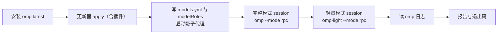
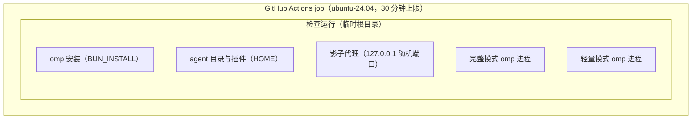

# 配置检查（CI）

本节点设计 omp-config 的配置检查：在一次性环境里安装最新 omp，用仓库自己的更新器应用配置，再用免费模型跑真实 session，把 omp 和扩展打印的故障与警告去重后逐个报告出来。

- **拥有**：检查运行的阶段、诊断的判据与分类、免费模型和影子模型的接入、workflow 的触发事件与权限。
- **不拥有**：配置项本身的规则（仓库 `README.md`）；更新器写什么、删什么（`agent/omp-config-update.ts` 头注释）；各扩展的行为（`README.md`「本地扩展」）。
- **非目标**：让模型执行任务或调用工具；验证付费 helper 的判定（`task-split-check`、`task-completion-judge`）；TUI 专属行为；拦截合并（不设 branch protection）。
- **输入**：仓库工作区（被检查对象），npm 上的 `@oh-my-pi/pi-coding-agent`，`install-plugins.sh` 声明的插件，Kilo 网关的匿名免费模型。

实现：`ci/check.ts`（检查运行），`.github/workflows/config-check.yml`（触发）。

## 问题

### 域性质

以下性质由隔离 HOME 中的实测得出（omp 18.8.7，Linux amd64 与 macOS arm64，2026-10-10）。

1. **omp 不用退出码表达配置故障。** 扩展 import 抛错、`session_start` 或 `before_agent_start` 抛错、system-prompt-replace 规则找不到目标，进程都以 0 退出。故障只出现在三处：stderr（如 `Failed to load extension …`、`system-prompt-replace: … found no target …`），RPC 的 `extension_error` 事件，`$HOME/.omp/logs/omp.<date>.<pid>.log` 中 `warn` / `error` 级记录。
2. **一部分故障要真实模型请求才出现。** `before_agent_start` 只在 prompt 被准备时运行，而 omp 在此之前检查模型凭据；没有可用模型时，启动类检查走不到这些钩子。
3. **配置引用的模型都要付费凭据。** `task.agentModelOverrides`、`lang-nag.json`、`input-polish.json`、`thinking-translator.json` 引用 openai-codex、anthropic、opencode-go、bansos 的模型；CI 没有这些凭据，引用它们的 helper 会自己报“模型不可用”。
4. **Kilo 网关的 `:free` 模型允许匿名调用、不计费**（kilo.ai 文档：每 IP 每小时 200 次）。`nvidia/nemotron-3-ultra-550b-a55b:free` 能处理完整配置的 system prompt（约 2 万 token）。同期实测：配置里的 `bansos` 免费 Muse 与 Zen big-pickle 返回 429 `FreeUsageLimitError`；`opencode-go` 按官方价目收费；Kilo `cohere/north-mini-code:free` 对完整配置的请求返回 422。
5. **仓库公开。** 来自 fork 的 PR 代码不可信，fork PR 的 workflow 拿不到 secret。

### 需求

- **R1**：push 到 `master`、每个 PR、每天定时、手动触发时，各运行一次检查。
- **R2**：配置有任一故障或警告时检查为红，每个不同的故障给出一次原文和出现位置；没有时为绿。
- **R3**：免费模型不可用时检查也为红，但报告标明“配置未验证”，与配置故障分开。
- **R4**：不使用任何 secret；`GITHUB_TOKEN` 只读。
- **R5**：只报告，不阻止合并（操作员 2026-10-10 裁决）。

## 定义

- **检查运行**：`bun ci/check.ts` 的一次执行。它在新建的临时根目录里创建 HOME、`PI_CODING_AGENT_DIR=$HOME/.omp/agent`、`BUN_INSTALL` 和 `TMPDIR`，结束时删除整个根目录。它不读写运行者真实的 `~/.omp`、`~/.pi`、`~/.claude`。
- **诊断**：检查运行收集到的一条故障或警告。每条诊断有一个阶段和一个类别：
  - `config`：配置或扩展造成，或无法排除是它们造成；
  - `environment`：omp 本身装不上；
  - `provider`：免费模型服务失败（HTTP 408、429、5xx，或连接、DNS 错误）。
- **发现**：类别相同、归一化文本相同的全部诊断合成的一条记录。归一化把临时根目录下的 HOME 换成 `~`、其余临时路径换成 `<tmp>`，并去掉模块缓存参数 `?mtime=…`。发现的标识是“类别 + 归一化文本”的 SHA-256 前 12 位十六进制；同一故障在不同运行、不同机器上得到同一个标识。
- **免费模型**：`models.yml` 中的 provider `ci-free`，直连 Kilo 网关，`auth: none`。检查的主模型与全部 `modelRoles` 都是它。
- **影子模型**：检查运行在 `models.yml` 中为配置引用的每个 `provider/model` 登记的同名条目（`auth: none`，`api: openai-completions`）。它的请求发往本机回环上的影子代理，代理把请求里的模型名换成免费模型后转发给 Kilo。配置因此不经修改就能在没有付费凭据的机器上解析并调用它引用的模型。
- **主机噪声**：由 CI 主机自身状况引起的日志 `warn`，在 `ci/check.ts` 的 `HOST_LOG_WARNINGS` 中逐条列出，每条写明它对应的主机事实。

## 架构

### 检查运行的阶段



|阶段|做什么|产生的诊断|
|---|---|---|
|install|`bun install -g @oh-my-pi/pi-coding-agent@${OMP_VERSION:-latest}`，`omp --version`|失败为 `environment`，检查就此结束|
|apply|`bun agent/omp-config-update.ts apply --source <仓库> --agent-dir … --json`|stderr 每行；JSON 报告的 `errors`；`pluginsMissing` 每项；没有 JSON 报告|
|models|写 `models.yml`（免费模型 + 影子模型），把 `config.yml` 的 `modelRoles` 设为免费模型|无|
|full session、light session|RPC 模式启动，等 `ready` 后发一条 prompt，保持 stdin 直到 `prompt_result`，再关闭并等进程退出|见下方判据|
|omp 日志|读 `$HOME/.omp/logs/*.log` 的 `warn`、`error` 记录|不属于主机噪声的每条记录|

`modelRoles` 是更新器不写的本机字段（`LOCAL_CONFIG_FIELDS`）。检查运行像一台机器那样设置它，因此不改变被检查的托管配置。

### 诊断判据

session 阶段的每一项都是一条诊断：

- stderr 的每一个非空行；
- stdout 上不是 JSON 的行（扩展直接打印会破坏 RPC 协议）；
- 每个 `extension_error` 事件；
- prompt 被拒绝（`response.success: false`），或 `prompt_result.status` 不是 `completed`；
- assistant 回复 `stopReason` 为 `error` 或 `aborted`：符合 R3 条件的记为 `provider`，其余记为 `config`；
- 回复来自免费模型以外的 provider 或模型；
- 没有任何 assistant 回复，或超过 300 秒未结束；
- 进程退出码非 0。

免费模型失败会连带产生别的诊断，它们也记为 `provider`：session 中所有失败回复都符合 R3 条件时，该 session 的 `prompt_result` 未完成和非零退出；omp 日志记录的 `error` 或 `errorMessage` 字段是免费模型服务失败（连接、DNS、超时、限流、5xx）时，该记录。影子代理收到上游 HTTP 400 及以上的响应时，记一条 `provider` 诊断。

同一个故障会在多处出现：完整模式和轻量模式各打印一次，omp 日志里再记一次。报告不逐条列诊断，而是按发现列出，每条发现写明标识、类别、各阶段出现次数和归一化文本。为让同一故障的不同表述得到同一标识，有两条规则：

- omp 日志中上下文只有 `path`、`error` 两个字段的记录，按 omp 在 stderr 上的格式写成 `<message> <path>: <error>`。
- omp 会把过长的 stderr 行截断并以 `…` 结尾。截断行去掉 `…` 后（截断点落在绝对路径中时，再去掉这段路径）恰好是一条完整文本的前缀时，并入那条发现；有多条候选时不合并。

主机噪声同样按归一化文本合并，并注明次数。

检查运行的退出码按诊断的类别判定，不受合并影响：有 `config` 或 `environment` 诊断时为 1；只有 `provider` 诊断时为 2；没有诊断时为 0。报告写到 stdout 和 `$GITHUB_STEP_SUMMARY`，在 GitHub Actions 中每条发现另发一条 `::error` annotation，标题是发现的标识和类别。

### 生命周期



|部件|开始|结束|
|---|---|---|
|检查运行|`bun ci/check.ts` 启动，`mkdtemp` 建根目录|报告写完后删除根目录（`CI_KEEP_ROOT=1` 时保留）|
|影子代理|安装开始前启动|检查运行的 `finally` 中停止|
|omp session 进程|阶段开始时 spawn|`prompt_result` 后关闭 stdin、进程退出；300 秒未结束时 SIGKILL|

### 决定

- **用 GitHub-hosted runner，不用 GARM。** 因为域性质 5：fork PR 的代码不能接触 homelab mesh。所需端点（npm、GitHub、Kilo）都在公网。重审条件：检查需要访问私网服务。
- **免费模型选 Kilo `nvidia/nemotron-3-ultra-550b-a55b:free`。** 因为域性质 4，其余候选或额度耗尽、或收费、或拒绝完整配置的请求。代价：GitHub runner 的出口 IP 是共享的，每小时 200 次的额度可能已被别人用完，此时检查以退出码 2 结束（R3）。重审条件：该模型下线，或出现频繁的 429。可用 `CI_FREE_MODEL`、`CI_FREE_BASE_URL` 换模型而不改代码。
- **影子模型而不是配置覆盖。** 替代方案是用 `--config` overlay 把 `task.agentModelOverrides` 等改成免费模型。它会改动被检查的配置，使检查验证的是 overlay，而不是仓库。影子模型只改机器本地的 `models.yml`，配置原样运行。代价：影子列表由 `ci/check.ts` 从 `config.yml` 和 JSON sidecar 中读出；扩展源码里硬编码的模型（如 `task-split-check` 的 `openai-codex/gpt-6-sol`）不在列表里。它们只在调用 `task` 等工具时才被请求，检查的 prompt 只要求文字回复；这些 helper 缺凭据时按各自规则放行，属于覆盖边界之外。
- **始终安装最新 omp。** 操作员裁决：机器通过 `omp update` 跟随最新版，检查也跟随。代价：上游的变化会让与之无关的提交也变红；这类红是真实的兼容性问题，比如 system-prompt-replace 规则的目标被上游删掉。可用 `OMP_VERSION` 在本地复现指定版本。
- **插件不钉版本。** 与 `install-plugins.sh` 一致：检查装的就是机器会装的。
- **stderr 每行都是诊断；日志只排除主机噪声。** 扩展警告不设白名单，因为一条被放行的警告就是一个被接受的缺陷，应当修配置或开 issue。主机噪声只覆盖与配置无关的主机事实：没有本地模型服务器，没有 D-Bus。

### 触发与权限

`.github/workflows/config-check.yml`：

- 事件：`push` 到 `master`、`pull_request`、每天 03:17 UTC 的 `schedule`、`workflow_dispatch`。不使用 `pull_request_target`。
- 权限：`contents: read`；checkout 不保留凭据（`persist-credentials: false`）；不引用任何 secret。
- 并发：同一事件、同一 ref 的新运行取消旧运行。
- Actions 按提交 SHA 固定版本；Bun 取最新版。

## 覆盖边界

检查覆盖：仓库配置能被更新器应用（结构化文件可解析、插件可安装）；完整模式和轻量模式下全部本地扩展与插件能加载；一次真实 prompt 期间 `session_start`、`before_agent_start`、`context` 等钩子不报错；system-prompt-replace 规则全部找到目标；配置引用的模型在影子模型下可解析。

检查不覆盖：

- 工具调用与 subagent 派发路径（`fork_task`、`subagent-todo`、`isolation-nudge`、`task-split-check`、`task-completion-judge`、`ctx` 等工具的行为）；
- 付费模型本身的可用性和凭据；
- TUI 专属行为（`input-polish` 的按键与 overlay，`omp-thinking-translator` 的渲染，`bro` 的 overlay）；
- 自动更新的联网路径（`auto`、`/omp-config-autoupdate run`）和维护命令（`/update-omp`、`/sync-omp-config`、`/migrate-omp-keys`）；
- Windows 的 `omp-light.cmd`。

## 本地复现

```bash
bun ci/check.ts                      # 与 CI 相同的检查；只写临时目录
OMP_VERSION=18.8.7 bun ci/check.ts   # 指定 omp 版本
CI_KEEP_ROOT=1 bun ci/check.ts       # 保留临时根目录以便排查
```

需要 Bun、git 和公网访问。
