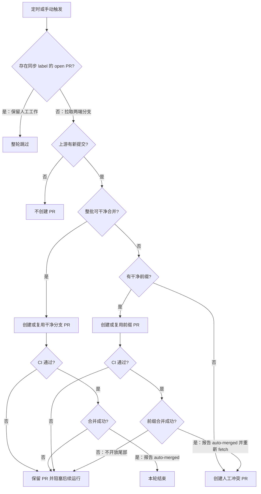

# 同步模板的机制与修改边界

对照同目录上一级的 [sync-upstream.yml](../sync-upstream.yml) 阅读。日常接入走 [主教程](../SKILL.md)；本文件用于改行为或解释日志，不是第二份实现。

## 控制流程

`gate_and_merge()` 显式检查 `gh pr checks` 和 `gh pr merge`：只有二者均成功才打印 `auto-merged` 并返回 0；CI 或合并失败均返回 1。调用者使用 `||` 或 `if !`，不能依赖 `set -e` 自动中断函数，因此 merge 的显式失败分支必须保留。前缀调用方收到非零后结束本轮，不执行后续 fetch 或创建尾部 PR；整批干净合并的调用方则结束本轮并保留未合并 PR。目标仓库验收同时覆盖 CI 失败和 CI 通过但 merge 失败。

## 实现中必须保持的关系

- `checkout` 使用 `SYNC_PAT` 且 `fetch-depth: 0`。同一 PAT 作为 `GH_TOKEN` 驱动 PR 与 CI 查询，避免 checkout 推送身份和 gh 身份分裂。
- `concurrency.group` 把手动与定时运行串行化；open PR 闸门保护跨运行的人工处理期。两者不能互相替代。
- `MERGE_BRANCH`、`REVIEW_BRANCH` 与 `BASE_BRANCH` 定义 PR 身份。不要在每次运行生成新分支名，否则“复用现有 PR”的查询失去意义。
- `open_pr()` 先按 head/base 查询，再创建，创建失败后再次查询；只有查到真实 PR 号才能继续解释后续 CI。不要把所有 422 都当作成功，也不要让诊断污染 stdout。
- 模板用 `gh api` 传分支名创建 PR，避免要求本地 checkout 正好位于同步分支。不要为了简短替换为依赖当前 checkout 的调用。
- `gate_and_merge()` 给 CI 注册留出等待，再使用 `gh pr checks --watch --fail-fast` 和 `gh pr merge --merge`。等待时间本身不能证明 CI 已注册，首次接入仍须观察真实 checks。
- 无新提交由 `merge-base --is-ancestor` 判断；可干净合并由 `merge-tree --write-tree` 判断。它计算合并结果，不需要改动工作树。
- 冲突路径按新提交顺序尝试，遇到首个冲突停止扩展前缀。前缀 CI 和合并均成功后才重新 fetch 接收分支并开放尾部，确保尾部比较基准包含前缀。fetch 本身不能证明前缀已落地，验收仍须核对实际 PR 与目标分支。

## 维护规则

修改分支名、label、目标仓库或 CI 触发方式时，同时核对 PR 复用、重入闸门与权限，不只替换显示文字。不要移除闸门来处理卡住的 PR。

Workflow 成功状态不等于目标分支已经推进：模板在“无新提交”“跳过”以及 CI 或 merge 失败路径都可正常结束，调用方有意保留 PR 供处理。函数返回非零负责阻止成功日志和前缀后的尾部流程，不把这些终态变成红色 run。解释一次运行时必须核对实际 PR 合并状态与目标分支，区分这些终态。

流程只决定 Git 合并；下游是否发布由目标仓库决定。模板头部的 Release 禁用注释不执行任何禁用操作，不能作为新接入仓库的发布安全保证。
