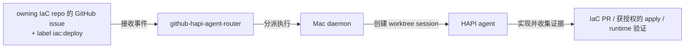

# iac-auto-deploy-issue

本 skill 写的是 IaC 自动部署路径的 issue 契约：在 owning IaC repo 里开一个带 `iac:deploy` label 的 issue，被这条链消费——



先用 `iac-projects` / `internal-services` 定位 owning repo，再用 `iac-issue-routing` 确认这是 IaC 变更而非普通 app 工作，最后用本 skill。通用 issue 规范走 `writing-issue`；本 skill 只特化 `iac:deploy` 的 issue body。

**特化子形态**：如果本次 IaC 变更的核心是"把一个容器化 workload 接入 Komodo 自动 CD、装配完之后每次 tag 都自动 rollout"，用 `iac-cicd-onboarding-issue` 的 body 契约（它是本 skill 的收窄版）。本 skill 覆盖更大的 `iac:deploy` 面（含 CT/VM 生命周期、cloud-init、netbird、DNS、OpenBao 类）。

## 何时用 `iac:deploy`

按 `iac-issue-routing` 先排除普通 workload 迭代和未决设计。以下全部满足才加触发标签：

- issue 位于 `mouriya-s-lab/homelab-tf` 或 `mouriya-s-lab/pve-vctcn`。
- 结果是一次真实的 IaC 变更，不能仅靠 owning workload repo 的 CI/CD 完成。范围包括 CT/VM、cloud-init、网络/DNS/ingress、根信任服务、GARM 配套、Komodo Core/Periphery，以及需要 IaC 落地的凭据配置。
- source/artifact/version 或目标 state、目标边界、流量、持久化、secret 用途及 runtime 证明已足够明确。
- HAPI agent 将在 owning repo 规则和授权范围内实现、开 PR、执行批准的 preview/apply 并收集 live 证据。

纯 research/spike、产品讨论、retroactive umbrella 不触发部署。未就绪的 body 写明 blocker；就绪后再补 `iac:deploy`，其他语义 label 按 repo 惯例保留。

## 核心规则：从已知事实可执行，不是死模板

issue 要详细到 HAPI agent 无需重新发现基本部署契约就能开工，同时把那些事实确实未知的实现选择留给 IaC repo。按这两条测试写：

1. **已知即写**：当前对话、关联的 app PR、release、README、既有 IaC issue、service inventory 已经告诉你 repo / service / artifact / port / health endpoint / hostname class / secret 用途 / 持久化需求，就写进 issue。
2. **未知不编**：当前证据没给出 VMID / module 名 / port / hostname / path / 确切命令，就别造。说清哪个决策留给 IaC agent、以及什么约束界定那个决策。

这是可直接实现的部署 brief，不是逐步代码配方：module/resource 名和文件布局只有在当前 repo 惯例或外部约束已固定时才指定。必需数据写在 body，不靠 label 或对话历史传递。

## body 契约

body 一律中文，遵循 `writing-issue`。按下列顺序用这些 section，只省真正不适用的，不要留占位文字。验收行要具体到能跑；当确切 workspace 命令须由 IaC agent 从 repo-local rules 里选时，可点名一个 repo 批准的命令族——例如「在 `apps/vctcn-app1` 跑该 workspace 的 `tofu plan`」（workspace 已知时）可接受，「跑测试」不可接受。

```markdown
## 目标

<一句话说明 IaC 完成后外部可观察的状态。>

## 自动部署入口

- **触发标签**: `iac:deploy`
- **目标 IaC 仓库**: `mouriya-s-lab/<homelab-tf|pve-vctcn>`（本 issue 所在仓库）
- **执行上下文**: HAPI worktree agent 在该仓库内实现；实现 PR 必须关闭本 issue。
- **执行模式**: <新部署 / 修改既有部署 / 回滚或修复 / 指针或版本更新 / GARM·registry·Komodo·edge 配套变更>

## 已知上下文

- **来源**: <用户请求、app repo issue/PR、release、commit、artifact、镜像 tag、设计文档等；能链接就链接。>
- **部署形态**: <local-cicd 形态：image service / app-level deploy / release artifact consumption / ResourceSync / GARM-only / 其他。>
- **服务/工作区**: <已知 workspace、app 目录、Komodo stack、VM/CT、域名、mesh 名；未知但应由 IaC 决定时写边界。>
- **运行接口**: <监听端口、health/version endpoint、webhook endpoint、CLI/API 行为、调用方。>
- **依赖**: <出站服务、数据库、registry、Keycloak、OpenBao、NetBird、GitHub webhook 等。>
- **持久化/备份**: <需要保留的数据、volume/bind mount 语义、可重建缓存。>
- **按用途列的 secrets**: <只写用途和权威来源，不写 secret 值。>

## 执行契约

- <完成态 1：最终用户/调用方能观察到什么。>
- <完成态 2：IaC 声明层必须持久化什么。>
- <完成态 3：deploy/apply 后必须读回什么 live state。>
- <允许改动范围：哪些 workspace/submodule/app 配套文件可改。>
- <不应改动范围：哪些 host/manual/runtime 状态不可顺手改。>

## 约束

- <来自目标 IaC repo AGENTS/rules 的约束摘要，例如 OpenTofu only、full apply boundary、pve-vctcn no Ansible、homelab CT 通过 proxmox_pct_remote 等。>
- <来自 app/product 的硬约束，例如必须使用某镜像 tag、必须对外暴露 webhook endpoint、必须走 NetBird。>
- <安全/凭据约束：secret 只能来自 SOPS/Keychain/Komodo/OpenBao/既有 CLI auth 等，不能要求用户粘贴。>

## 验收标准

| # | 维度 | 检查 | 命令 | 环境 | 预期 |
|---|------|------|------|------|------|
| 1 | preview | <预览目标边界变更> | `<repo 批准的 plan/check 命令>` | local/IaC repo | 无非预期 create/destroy/restart/drift |
| 2 | apply | <应用目标边界> | `<repo 批准的 apply/deploy 命令>` | local/IaC repo | exit 0，且作用域与本 issue 一致 |
| 3 | live-state | <从控制面读回声明状态> | `<tofu output / ssh / km / API / gh / curl 命令>` | live | 读回值匹配声明 |
| 4 | runtime | <用户可见行为 smoke> | `<curl / webhook / docker / app CLI / workflow 命令>` | live | 返回预期状态/响应/日志 |

## 依赖关系

- Depends on: <issue/PR/release/artifact；没有就写「无」。>
- Blocks: <被本部署解锁的 app issue/PR；没有就写「无」。>
```

## repo 专属约束片段

先从当前 repo 的 `AGENTS.md`/rules 核实，再摘录与本 issue 有关的片段；下面是定位线索，不是替代当前规则的 live snapshot。

### `homelab-tf`

- 用 OpenTofu（`tofu`），不是 Terraform。
- full state/playbook 边界 apply 是 PR 契约的一部分；plan-only 不算完成。
- Ansible 经 Proxmox `pct exec` 通过 `community.proxmox.proxmox_pct_remote` 到达 CT；不要求 CT 侧 sshd。
- `<app>/` 下的 per-app Ansible role submodule 改动后，需对齐 parent pointer 并跑 parent 边界 apply。
- repo-backed workload 的 compose/Stack 声明在 owning workload repo，经 ResourceSync 消费；Komodo Core 与 Sync 资源 provisioning 属于 IaC。不把手跑 compose 或控制面 inline override 当持久声明。
- 新建或改 bind-mount 的 CT 需做持久化验证；适用时附 destroy/rebuild 证据。

### `pve-vctcn`

- 用 OpenTofu（`tofu`），不是 Terraform。
- 本 repo 无 Ansible、无基于 Makefile 的 deploy 路径。
- per-app workspace 在 `apps/<name>` 下，用 `null_resource` / `local_file` / provisioner 部署渲染后的文件，通常以 `docker compose up -d --remove-orphans` 收尾。
- VM 180/181/182 是当前 managed 的 app/runner/registry placement；VMID 180-256 是 TF 管理区间。除非 issue 明确就是分配新 VM，否则不要造新 VMID。
- NPM CT 171 是手动 public ingress；app VM 一般不需要为 web 流量直接做 public DNAT。
- managed guest 的连接面是 NetBird mesh DNS `<hostname>.mouriya.lan`；PVE API / host SSH 面是 public host `192.99.9.212`。
- GARM repo/pool 记录存在 VM 181 的 GARM sqlite 里；TF 提供 host helper 但不拥有那些 runtime 行。

## 按任务灵活取舍

别机械填满每个字段。从真实任务出发，纳入让部署可执行的事实：

- **版本升级 / 插件安装**：强调 release tag、checksum/artifact、既有 workspace、apply 边界、live plugin/API 探测。
- **新服务**：强调 source artifact/image、监听口、health check、持久化、按用途列的 secrets、入站调用方、暴露 class、registry/Komodo/NPM/DNS 归谁。
- **GARM/registry 接线**：强调 repo/pool label、artifact workflow、registry secret sync、runner 网络证明、哪些 state 是 runtime GARM 而非 IaC。
- **webhook/daemon 路径**：强调 endpoint path、GitHub event 契约、label/filter 语义、内部 NetBird 调用方/被调方、daemon handoff、日志、端到端 webhook smoke。

