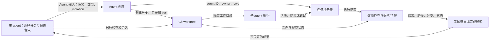

# Claude Code 2.1.280：Subagent Worktree 设计报告

**状态：** 本机安装包的逆向设计重建；不是 Anthropic 的内部设计文档，也不是给 OMP 制定的实现方案。  
**读者：** 希望理解 subagent 隔离、状态回传和合入边界的 harness 维护者。  
**范围：** `Agent` 工具启动的本地 subagent。`claude agents` 的独立后台会话、agent teams、云端 agent 和 `/batch` 不在这条执行路径内；这些模式的协调与隔离契约不同。[官方并行模式对比](https://code.claude.com/docs/en/agents#choose-an-approach)对此有明确区分。

## 结论与问题域

Claude Code 让主 agent 知道子 agent 的 worktree，并不主要靠子 agent 在最终报告中自述：调用时生成的 agent ID、任务注册表、运行时保留的 worktree 路径/分支，以及交给所属 agent 的完成通知共同提供了可关联的信息。但 `completed` 只说明一次子 agent 执行完成，**不说明成果已合入目标分支**。本次追踪的本地 `Agent` 路径只负责创建、检查、保留或清理 worktree，并把待处理成果交还主 agent；没有发现该路径自动运行 `git merge` 或 `cherry-pick`。

问题域有三个独立的事实来源：Git 决定工作目录、分支和文件/提交状态；Claude Code 的任务注册表决定 agent 的执行状态和归属；最终目标分支是否接受某项改动，需要合入后的 Git 状态和验证来证明。将三者压成一个“已完成”状态会误报。以下驱动是**从实现反推**，不是 Anthropic 公布的原始需求：

| 场景 | 可证伪的响应 |
| --- | --- |
| 两个写入型子 agent 并行工作 | 显式隔离时各在自己的 checkout 中运行；不能把创建失败伪装为主 checkout 中的隔离运行 |
| 子 agent 完成但没有留下工作 | 临时目录与分支可安全清理，不产生待合入路径 |
| 子 agent 留下文件或新提交 | 不删除成果；返回可定位的 worktree 路径和分支 |
| 任务仍在运行或状态不可核实 | 主 agent 不提前报告结果；清理失败时保留待检查对象 |

## 设计决定与责任

### 隔离由调用和定义选择，不是普遍默认

`AgentInput.isolation?: "worktree" | "remote"` 是单次调用的选择；agent 定义也可设置 `isolation`。调度代码 `an` 取调用参数优先、定义次之；`Hn` 再决定本地/远端和同步/后台。未指定 worktree 的本地子 agent 可共用工作目录。另有提示在并行写入可能碰撞时建议为每个 agent 指定 worktree，但提示不等于运行时自动为所有子 agent 分配 worktree。内置 web-fetch agent 会忽略这种隔离请求。证据：`sdk-tools.d.ts:750–786`；二进制偏移 `183916662` 起的 `an`、`Hn`、`go`，以及偏移 `180364101` 起的并行写入提示。

这项决定保留了轻量、共享目录的调用方式；代价是调用者须识别写入冲突。`go` 对请求隔离但无法建立 Git worktree、也没有 `WorktreeCreate` hook 的情况报错，不以共享目录静默降级。插件可在 `agent.spawn` 时介入，但重写仍受权限检查；worktree 隔离与显式 `cwd` 冲突时会拒绝。证据：二进制偏移 `183916662–183952474`。

### 以 agent ID 关联执行与 Git 资源

默认 Git 路径下，`go` 生成 agent ID，调用 `Cke(mQn(id))`；`mQn` 构成 `agent-<id>` 名称。`Iwe` 将其放在仓库 `.claude/worktrees/<name>`，分支为 `worktree-<name>`，运行 `git worktree add --no-track -B …`。工作目录传给子 agent 的 session。创建路径有符号链接和目录归属检查；运行时用含进程身份的 Git worktree lock 防止并发清理。证据：二进制偏移 `178495153–178498648`、`178514366`、`183916662–183952474`。

默认 `worktree.baseRef: "fresh"` 从远端默认分支建立；`"head"` 则从当前本地 `HEAD` 建立。远端不可用时有回退，但不能把该回退当作“总是继承父分支”。两者都不会自然包含主 checkout 的未提交修改；需要此上下文时必须另行处理。[官方基线说明](https://code.claude.com/docs/en/worktrees#choose-the-base-branch)与本机 `Iwe` 分支相符。`.worktreeinclude` 可按规则复制同时被 Git 忽略的文件，但不是复制任意未提交源码。[官方复制规则](https://code.claude.com/docs/en/worktrees#copy-gitignored-files-into-worktrees)。

### 执行状态和成果状态分开交付



同步调用的 `AgentOutput` 可以直接返回 `status: "completed"` 以及可选的 `worktreePath`、`worktreeBranch`。后台调用首先返回 `status: "async_launched"`、`agentId` 和 `outputFile`；**这不是完成结果**。执行循环 `GG` 将活动和用量更新到任务注册表，结束时调用 worktree 收尾回调，`lXe` 再构造给所属 agent 的 `task-notification`，携带状态、报告、用量及保留的路径/分支。证据：`sdk-tools.d.ts:100–180`；二进制偏移 `183683853–183692978`、`180821513–180831302`、`183957443–183958197`。后台结果在后续轮次到达，见[官方 subagent 说明](https://code.claude.com/docs/en/sub-agents#run-subagents-in-foreground-or-background)。

一次通知不保证该 agent ID 永远终止：完成的 subagent 可以被继续，新的运行及其通知仍须按同一身份关联。主 agent 不能把“正在运行”、一次“已完成”、worktree“有成果”和目标分支“已合入”混为一谈。

## 场景走查与失败边界

**无改动完成：** 创建并锁定 worktree，子 agent 执行；收尾回调检查 dirty 文件和相对创建基线的新提交。两者均不存在，且移除成功，才清理 worktree/分支，不回传待合入的路径。源码是 `go` 中的 `Ye` 回调、`$ht`、`Ehe`、`Hq`；二进制偏移 `183916662–183952474`、`178535789–178546571`。

**有改动完成：** 检查发现文件改动或新提交后保留 worktree，解锁并返回路径和分支。`Agent` 同步工具结果会将二者写成 `worktreePath`、`worktreeBranch`；后台通知另有 worktree 信息段。主 agent 可以据此检查 diff 和目标分支，再自行选择合入方式。内置提示也说明结果会带回“branch and worktree path to merge”（偏移 `180378422–180381906`）。它不是自动合并的调用。

**故障或中断：** 创建前会验证路径及仓库；已有锁不是自己的活跃进程时，不夺取资源。清理时若发现文件可能丢失、Git 状态无法可靠核实、worktree 归属不明或路径受到链接影响，采取保留/拒绝删除的路径。异常退出留下的、由 Claude Code 设置的锁由后续清扫核查；它不会解锁用户自行设置的锁。证据：二进制偏移 `178514366`、`178535789–178553261`，以及[官方保留与清扫规则](https://code.claude.com/docs/en/worktrees#clean-up-subagent-and-background-session-worktrees)。

**延迟清扫：** 完成时留下的 worktree 不是无限期无条件保留。保留期清扫只考虑其可归属的资源，检查 Git 创建标记、改动、未推送提交、submodule 状态和锁；仍有工作或不能核实就留下。[官方清扫规则](https://code.claude.com/docs/en/worktrees#clean-up-subagent-and-background-session-worktrees)列明了保留条件。因此“分支已被主 agent 使用”与“旧目录立刻消失”没有等价关系。

## 评估、适用范围与未决

| 决定及替代 | 获益 | 代价或敏感点 |
| --- | --- | --- |
| 显式 worktree，而非所有 subagent 强制隔离 | 只读/轻量调用不用创建 checkout；可由定义固定隔离 | 并行写入者若漏设仍可能共享目录，依赖提示与调用者判断 |
| 默认从远端默认分支，而非父会话 `HEAD` | 基线较干净、稳定 | 子 agent 可能看不到父会话已提交但未推送的工作；`baseRef: head` 改变这一取舍 |
| 有工作或检查不确定时保留，而非总在结束时删除 | 降低丢失成果风险 | 需要延迟清扫或人工处理；目录存在不代表尚未合入 |
| 返回路径/分支由主 agent 合入，而非完成时自动 merge | 主 agent 可先审查冲突与验证 | 完成通知本身不证明最终集成正确 |

**未决与证伪方式：** 本次是对已安装 2.1.280 的静态重建，没有在真实仓库触发子 agent。若一个干净、显式隔离的本地 `Agent` 调用在实际运行时修改了主 checkout，或完成时运行了未见于本路径的自动合并，则需以该运行的工具事件、Git reflog 和对应版本的源码重新评估以上结论。也不能从本报告推断 Claude Code **其他**模式绝无自动合并。

## 证据与复核

安装包：`/opt/homebrew/lib/node_modules/@anthropic-ai/claude-code/`；`claude --version` 为 `2.1.280`。二进制 `bin/claude.exe` 是 Mach-O arm64，内嵌 Bun `__BUN` 段；本文的十进制偏移针对**此安装版本**，升级后不稳定。随包 `sdk-tools.d.ts` 是公开工具输入/输出类型，二进制内的压缩后 JavaScript 用于确认实际分支和调用链。

可复核的只读命令：

```bash
claude --version
otool -l /opt/homebrew/lib/node_modules/@anthropic-ai/claude-code/bin/claude.exe
strings -a -t d -n 24 /opt/homebrew/lib/node_modules/@anthropic-ai/claude-code/bin/claude.exe
xxd -s 183957443 -l 192 /opt/homebrew/lib/node_modules/@anthropic-ai/claude-code/bin/claude.exe
```

最后一条可直接核对结果模板中的 `worktreePath`、`worktreeBranch`。本次**没有**创建真实 worktree 或执行合并；源码证据能证明上述控制流与接口，不能替代运行时冲突恢复测试。报告不参与本仓库的 `/sync-omp-config` 或 `/update-omp` 复制集。
